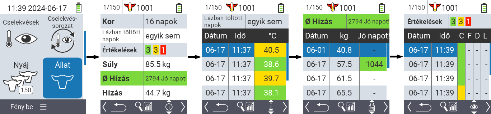
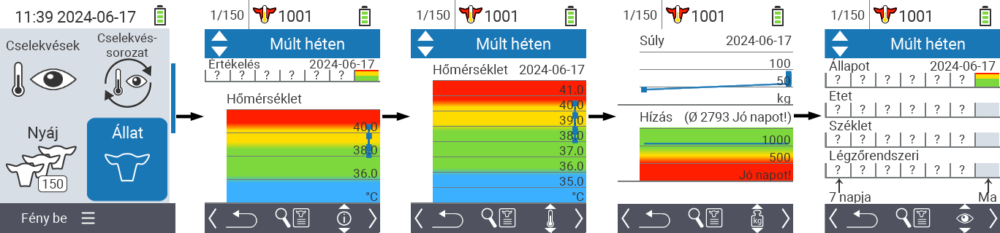
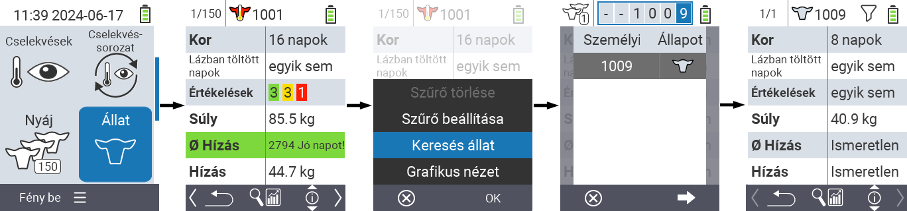
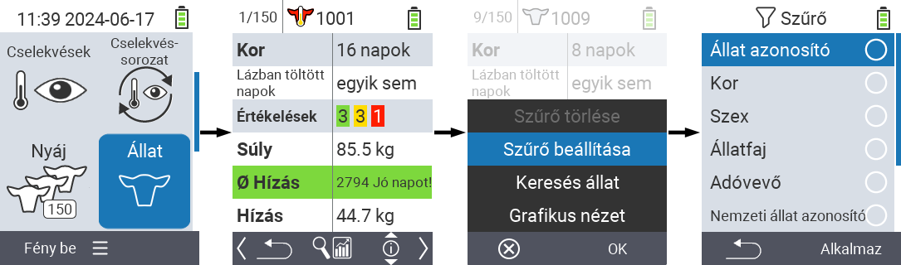

## Animal {#animal}

Funcția animal individual vă permite să vizualizați informații importante despre greutate, temperatură și evaluare pentru fiecare animal în parte. Aveți întotdeauna opțiunea de a afișa informațiile sub formă de grafic sau listă. Pentru a utiliza funcția de animal individual, procedați după cum urmează:

1. Pe ecranul principal al dispozitivului dvs. VitalControl, selectați elementul de meniu  `` și apăsați butonul ``.

2. Se deschide o prezentare generală a celor mai importante informații despre animal. Marginea superioară a ecranului vă arată ce animal vizualizați în prezent. Utilizați tasta `F3` pentru a alege între informațiile despre animal , temperatură , greutate  și evaluare .

{}
În cadrul fiecărei afișări de informații aveți opțiunea de a [căuta un animal](#search-animal), de a seta un [filtru](#set-filter) și de a comuta la o [vizualizare grafică](#set-graphical-view).
De asemenea, puteți comuta între animalele individuale în orice moment folosind tastele săgeată ◁ ▷.
{}

### Setare vizualizare grafică {#set-graphical-view}

1. Apăsați butonul superior mijlociu `On/Off`  pentru a deschide un meniu pop-up. În acest meniu, puteți alege între funcțiile ``, `` sau ``.

2. Selectați `` cu tastele săgeată △ ▽ și confirmați cu ``.

### Căutare animal {#search-animal}

1. Apăsați butonul `On/Off` din mijlocul superior  pentru a deschide un meniu pop-up. În acest meniu, puteți alege între funcțiile ``, `` sau ``.

2. Selectați `` cu tastele săgeată △ ▽ și confirmați cu ``.

3. Folosiți tastele săgeată △ ▽ ◁ ▷ pentru a selecta numărul dorit al animalului și confirmați cu ``

### Setare filtru {#set-filter}

1. Apăsați butonul `On/Off` din mijlocul superior  pentru a deschide un meniu pop-up. În acest meniu, puteți alege între funcțiile ``, `` sau ``.

2. Selectați `` cu tastele săgeată △ ▽ și confirmați cu ``.
Puteți obține instrucțiuni despre cum să utilizați filtrul [aici]().

