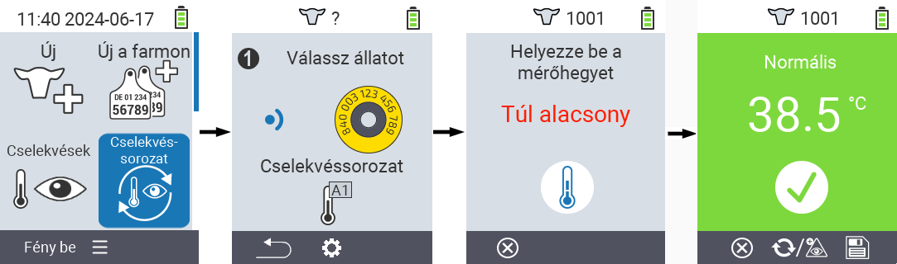
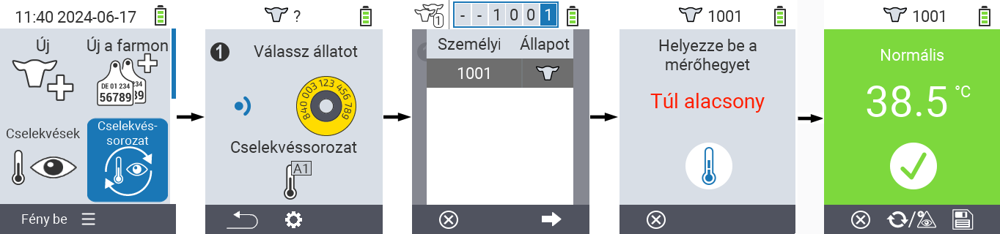

## Lanț de acțiuni {#chain-of-actions}

Lanțul de acțiuni vă permite să efectuați automat mai multe acțiuni pentru un animal una după alta. De exemplu, puteți selecta acțiunile `` și ``. Dacă apoi efectuați lanțul de acțiuni, puteți lua mai întâi temperatura animalului și înregistra evaluarea imediat după aceea.

### Utilizați lanțul de acțiuni {#use-chain-of-actions}

1. Pe ecranul principal al dispozitivului dvs. VitalControl, selectați elementul de meniu &nbsp;&nbsp; `` și apăsați butonul ``.

2. Fie scanați un animal folosind transponderul, fie confirmați cu `` și utilizați tastele săgeți △ ▽ ◁ ▷ pentru a introduce ID-ul animalului dorit.

3. Lanțul de acțiuni este acum executat. De îndată ce toate acțiunile din lanțul de acțiuni au fost efectuate, următorul animal poate fi selectat direct.



{}

{}
{}

{}


### Configurați lanțul de acțiuni {#set-chain-of-actions}

1. Pe ecranul principal al dispozitivului dvs. VitalControl, selectați elementul de meniu &nbsp;&nbsp; `` și apăsați butonul ``.

2. Utilizați butonul `F2` &nbsp;&nbsp; (``).

3. Apare un ecran suprapus. Folosește tastele săgeată △ ▽ pentru a alege între acțiunile listate 1 - 4 (poți efectua până la patru acțiuni consecutiv). Folosește tastele săgeată ◁ ▷ pentru a selecta acțiunea dorită pentru acțiunea respectivă. Salvează setările cu tasta `F1` &nbsp;&nbsp;.

4. Dacă dorești să resetezi întreaga secvență de acțiuni, selectează opțiunea `` în submeniu folosind tastele săgeată △ ▽ și confirmă cu ``.

    

{}
În cadrul acțiunilor individuale ai aceleași opțiuni de setare descrise în capitolul [Acțiuni](../actions) pentru fiecare acțiune individuală.
{}

{}
Simbolurile din ecranul de start al lanțului de acțiuni arată ce acțiuni ai setat și în ce ordine.
{}
