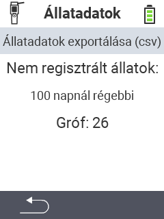

<map name="workmap">
  <area shape="rect" coords="2,40,238,80" alt="Exportă datele despre animale (csv)" title="Exportă datele despre animale&#10;Click mouse: deschide documentația" href="/en/docs/data-export/usb-drive/">

  <area shape="rect" coords="2,80,238,200" alt="Deregistrează animalele" title="Specifică vârsta de la care animalele ar trebui să fie deregistrate&#10;Click mouse: deschide documentația" href="/en/docs/device/data-management/animal-data/unregister-animal/">

  <area shape="rect" coords="2,282,120,319" alt="Înapoi" title="Toate informațiile și instrucțiunile pentru exportul datelor despre animale pot fi găsite aici&#10;Click mouse: deschide documentația" href="/en/docs/device/data-management/">
</map>
