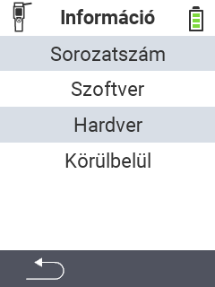

{}
Dacă faceți clic pe un element de meniu, veți fi redirecționat către o descriere a funcției respective.
{}

<map name="workmap">
  <area shape="rect" coords="2,40,238,80" alt="Serial number" title="Pentru a obține numărul de serie al dispozitivului dvs. faceți clic aici&#10;Mausklick: zur Dokumentation" href="/en/docs/device/info/serial-number/">
  <area shape="rect" coords="2,80,238,120" alt="Software" title="Instrucțiunile pentru vizualizarea versiunii software-ului dvs. pot fi găsite aici&#10;Mausklick: zur Dokumentation" href="/en/docs/firmware/versions/">
  <area shape="rect" coords="2,120,238,160" alt="Hardware" title="Pentru a accesa informațiile hardware ale dispozitivului dvs. faceți clic aici&#10;Mausklick: zur Dokumentation" href="/en/docs/device/info/hardware/">
  <area shape="rect" coords="2,160,238,200" alt="About" title="Accesați informațiile despre furnizor&#10;Mausklick: zur Dokumentation" href="/en/docs/device/info/about/">

  <area shape="rect" coords="2,282,120,319" alt="Back" title="Reveniți la nivelul anterior&#10;Mouse click: open documentation" href="/en/docs/device/">
</map>
