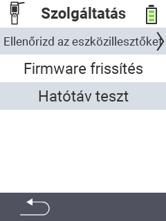

{}
Dacă faceți clic pe un element de meniu, veți fi redirecționat către o descriere a funcției respective.
{}

<map name="workmap">
  <area shape="rect" coords="2,42,238,82" alt="Verificați driverele dispozitivului" title="Instrucțiunile pentru verificarea driverelor dispozitivului dvs. pot fi găsite aici&#10;Click mouse: deschideți documentația" href="/en/docs/diagnosis/hardware/">
  <area shape="rect" coords="2,82,238,122" alt="Actualizare firmware" title="Instrucțiunile pentru actualizarea firmware-ului dvs. pot fi găsite aici&#10;Click mouse: deschideți documentația" href="/en/docs/firmware/update/">
  <area shape="rect" coords="2,122,238,162" alt="Test de rază" title="Instrucțiunile pentru efectuarea unui test de rază pot fi găsite aici&#10;Click mouse: deschideți documentația" href="/en/docs/diagnosis/rfid-scan/">

  <area shape="rect" coords="2,282,120,319" alt="Înapoi" title="Săriți înapoi la nivel&#10;Click mouse: deschideți documentația" href="/en/docs/device/">
</map>
