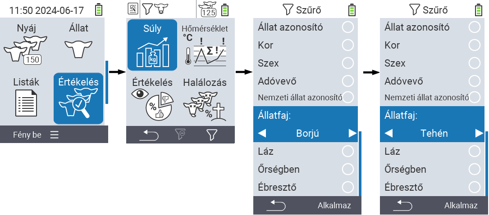
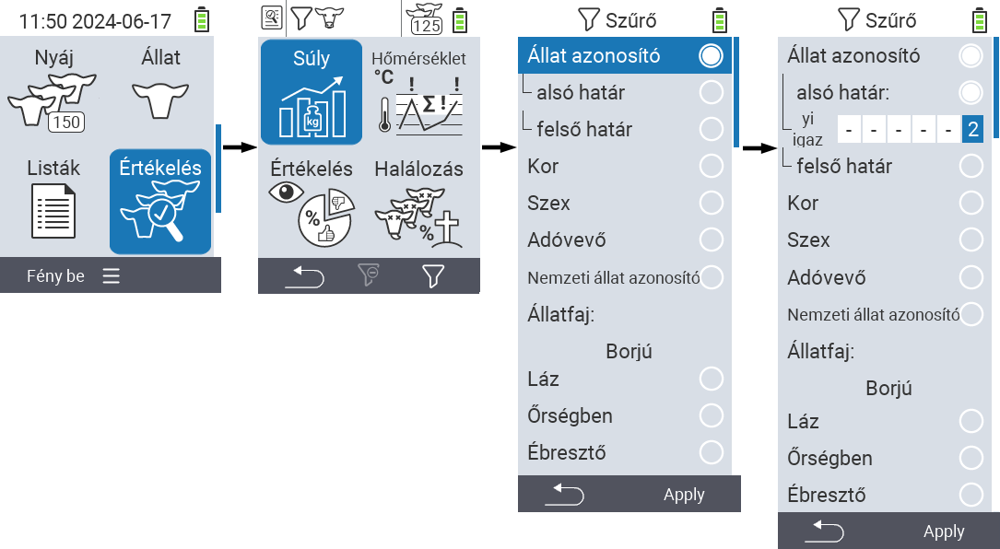
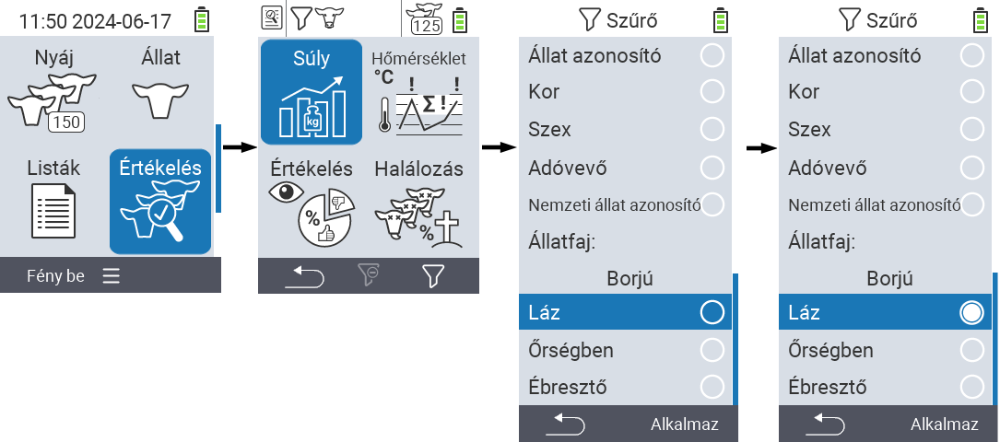

## Aplicarea filtrelor {#applying-filters}

{}
Filtrul te ajută să efectuezi o selecție folosind criterii de filtrare în cadrul elementelor de meniu ``, `` și `` ale dispozitivului VitalControl. De îndată ce aplici un filtru, simboluri pentru diferitele criterii de filtrare apar în partea de sus a ecranului. Aceste simboluri sunt folosite pentru a te ajuta să afli dacă și care criterii de filtrare sunt activate. De exemplu, dacă setezi filtrul `` pe masculin, dispozitivul va folosi doar animale masculine. De exemplu, dacă activezi și filtrul ``, dispozitivul va folosi doar animale masculine care sunt pe lista de observație.
{}

Pentru a crea un filtru în evaluări, procedează după cum urmează:

1. În submeniul aparținând elementului de meniu de sus  `` apasă tasta `F3`  o dată. În submeniul aparținând elementelor de meniu de sus  `` și  ``, trebuie să apeși tasta de două ori.

2. Se deschide un submeniu în care poți seta toate opțiunile de filtrare. Poți filtra după ``, ``, ``, ``, ``, ``, ``, `` și ``.

3. Pentru filtrele ``, ``, `` și `` navighează la zona corespunzătoare și confirmă cu ``. Folosește tastele săgeată ◁ ▷ pentru a specifica setarea dorită. Folosește tasta `F3` `` pentru a pune în aplicare setarea selectată. Pentru a renunța la modificările filtrului, apasă tasta `F1` &nbsp;&nbsp;.

4. Pentru filtrele `` și `` selectați criteriul corespunzător și confirmați cu ``. Acum vi se va arăta o limită inferioară și una superioară. Navigați la limita dorită folosind tastele săgeată △ ▽ și confirmați apăsând `` de două ori. Acum puteți seta numărul dorit folosind tastele săgeată ◁ ▷ și tastele săgeată △ ▽. Odată ce toate setările sunt corecte, apăsați din nou `` pentru a părăsi modul de setare și aplicați filtrul(ele) selectat(e) cu tasta `F3` ``. Folosind tasta `F1` &nbsp;&nbsp;, puteți renunța la modificările dvs. dacă doriți.

5. Pentru filtrele ``, `` și `` există posibilitatea de a dezactiva sau activa aplicarea lor. Pentru a face acest lucru, selectați filtrul corespunzător și confirmați cu ``. Filtrul este acum activ. Confirmați din nou cu `` pentru a dezactiva filtrul.

6. Odată ce ați setat toate filtrele, folosiți tasta `F3` `` pentru a pune în aplicare filtrele definite sau apăsați tasta `F1`  pentru a renunța la modificările aduse filtrului(lor).
