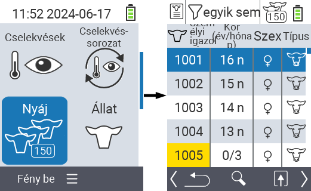
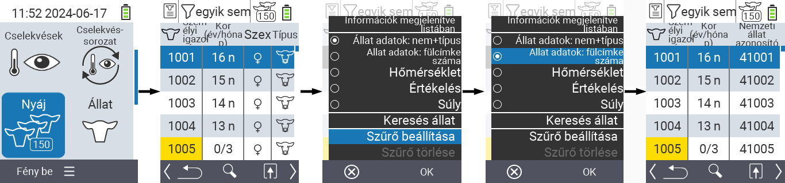
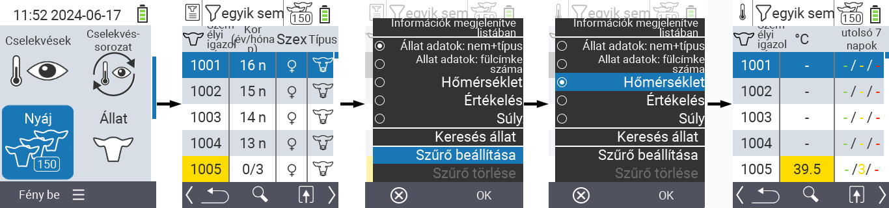
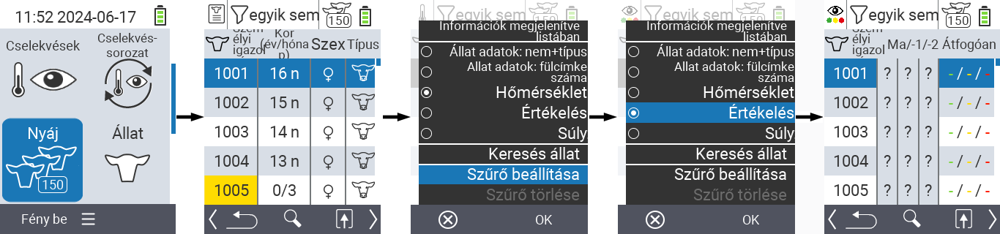
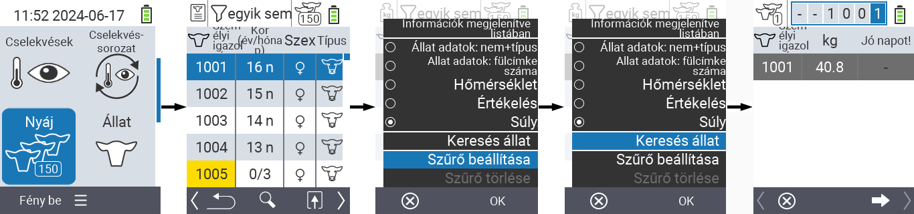
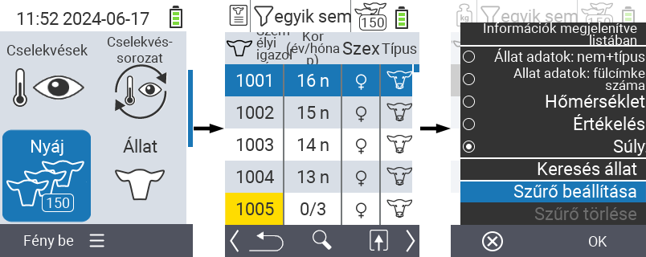
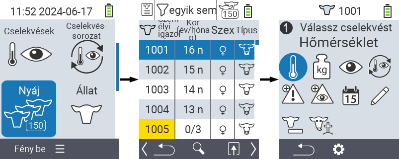

## Turmă {#herd}

În cadrul meniului Turmă, puteți vizualiza întreaga turmă, căuta animale individuale și afișa informații importante. Aveți următoarele posibilități:

- Vizualizați [datele animalelor](#view-animal-data)
- Vizualizați [datele de temperatură](#display-temperature)
- Vizualizați [datele de evaluare](#view-rating)
- Vizualizați [datele de greutate](#view-rating)
- [Căutați animale](#search-animal)
- Setați [filtru](#set-filter)
- [Acțiuni](#call-action-menu)

### Pași pregătitori {#preparatory-steps}

1. Pe ecranul principal al dispozitivului dvs. VitalControl, selectați elementul de meniu  `` și apăsați butonul ``.

2. Se deschide vizualizarea generală a turmei dvs.

    

### Vizualizați datele animalelor {#view-animal-data}

1. Completați pașii pregătitori.

2. Utilizați tasta `F3` &nbsp;&nbsp; pentru a invoca un meniu popup care listează categoriile de informații ce pot fi afișate pentru lista turmei. Utilizați tastele săgeată △ ▽ pentru a evidenția linia `` sau `` și selectați această categorie apăsând butonul central `` sau tasta `F3` ``. Cele două opțiuni de selecție diferă în afișarea barei de informații.

3. Datele animalelor vor fi acum afișate ca conținut al listei turmei.

4. Alternativ, puteți utiliza tastele săgeată ◁ ▷ pentru a comuta între diferitele opțiuni de afișare.

    

{}
În mod implicit, datele animalelor sunt afișate primele. Doar atunci când aveți afișată greutatea, de exemplu, trebuie să setați din nou afișarea datelor animalelor.
{}

### Afișează temperatura {#display-temperature}

1. Completați pașii pregătitori.

2. Folosiți tasta `F3` &nbsp;&nbsp; pentru a deschide un meniu popup care listează categoriile de informații ce pot fi afișate pentru lista de turmă. Folosiți tastele săgeată △ ▽ pentru a evidenția linia `` și selectați această categorie apăsând butonul central `` sau tasta `F3` ``.

3. Datele despre temperatură vor fi acum afișate ca și conținut al listei de turmă.

4. Alternativ, puteți folosi tastele săgeată ◁ ▷ pentru a comuta între diferitele opțiuni de afișare.

    

### Vizualizează evaluarea {#view-rating}

1. Completați pașii pregătitori.

2. Folosiți tasta `F3` &nbsp;&nbsp; pentru a deschide un meniu popup care listează categoriile de informații ce pot fi afișate pentru lista de turmă. Folosiți tastele săgeată △ ▽ pentru a evidenția linia `` și selectați această categorie apăsând butonul central `` sau tasta `F3` ``.

3. Datele despre evaluare vor fi acum afișate ca și conținut al listei de turmă.

4. Alternativ, puteți folosi tastele săgeată ◁ ▷ pentru a comuta între diferitele opțiuni de afișare.

    

### Afișează greutatea {#display-weight}

1. Completați pașii pregătitori.

2. Folosiți tasta `F3` &nbsp;&nbsp; pentru a deschide un meniu popup care listează categoriile de informații ce pot fi afișate pentru lista de turmă. Folosiți tastele săgeată △ ▽ pentru a evidenția linia `` și selectați această categorie apăsând butonul central `` sau tasta `F3` ``.

3. Datele despre greutate vor fi acum afișate ca și conținut al listei de turmă.

4. Alternativ, puteți folosi tastele săgeată ◁ ▷ pentru a comuta între diferitele opțiuni de afișare.

### Căutare animal {#search-animal}

1. Completați pașii pregătitori.

2. Utilizați tasta `F3` &nbsp;&nbsp; pentru a invoca un meniu popup care listează diverse opțiuni. Utilizați tastele săgeată △ ▽ pentru a evidenția funcția `` și invocați funcția de căutare apăsând tasta centrală `` sau tasta `F3` ``. Alternativ, puteți utiliza butonul `On/Off`  imediat după pasul unu.

3. Utilizați tastele săgeată △ ▽ ◁ ▷ pentru a introduce numărul dorit al animalului și confirmați cu ``.

    

### Setare filtru {#set-filter}

1. Completați pașii pregătitori.

2. Utilizați tasta `F3` &nbsp;&nbsp; pentru a invoca un meniu popup care listează diverse opțiuni. Utilizați tastele săgeată △ ▽ pentru a evidenția funcția `` și invocați funcția de filtrare apăsând tasta centrală `` sau tasta `F3` ``.

3. Cum să aplicați filtrul poate fi găsit [aici]().

    

### Apelare meniu acțiuni {#call-action-menu}

Aveți întotdeauna opțiunea de a apela meniul de acțiuni pentru un animal.

1. Completați pașii pregătitori.

2. Selectați un animal din listă cu tastele săgeată △ ▽ și confirmați cu ``.

3. Meniul de acțiuni este acum deschis. Cum să utilizați acest lucru poate fi găsit [aici](../actions).

4. Revenirea la lista de turmă se face cu tasta `F3`.

    
