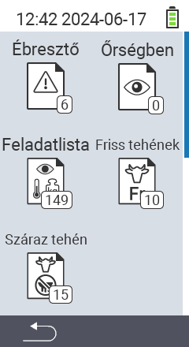

{}
Dacă faceți clic pe un element de meniu, veți fi redirecționat către o descriere a funcției respective.
{}

<map name="workmap">
  <area shape="rect" coords="3,40,116,160" alt="Lista de alarme" title="Verificați lista dvs. de alarme&#10;Click mouse: deschide documentația" href="/ro/docs/lists/alarm/">
  <area shape="rect" coords="3,160,116,280" alt="Lista de acțiuni" title="Verificați lista dvs. de acțiuni&#10;Click mouse: deschide documentația" href="/ro/docs/lists/actions/">
  <area shape="rect" coords="3,280,116,399" alt="Lista vacilor uscate" title="Verificați lista dvs. de vaci uscate&#10;Click mouse: deschide documentația" href="/ro/docs/lists/dry-cows/">

  <area shape="rect" coords="116,40,230,160" alt="Lista de supraveghere" title="Verificați lista dvs. de supraveghere&#10;Click mouse: deschide documentația" href="/ro/docs/lists/on-watch/">
  <area shape="rect" coords="116,160,230,280" alt="Vaci proaspete" title="Verificați lista dvs. de vaci proaspete&#10;Click mouse: deschide documentația" href="/ro/docs/lists/fresh-cows/">

  <area shape="rect" coords="2,401,115,438" alt="Înapoi" title="Reveniți un nivel înapoi" href="/ro/docs/menu/mainmenu/">
</map>
