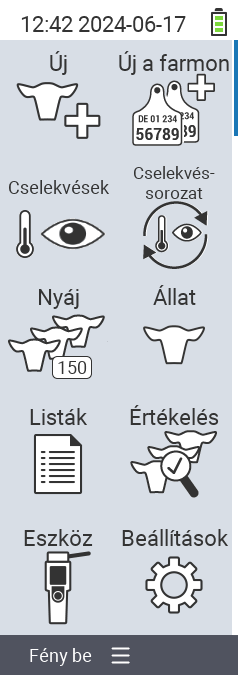

{}
Dacă faceți clic pe un element de meniu, veți fi redirecționat către o descriere a funcției respective.
{}

<map name="workmap">
  <area shape="rect" coords="3,40,116,160" alt="Nou" title="Creați animale noi&#10;Clic mouse: deschideți documentația" href="/ro/docs/new/">
  <area shape="rect" coords="3,160,116,280" alt="Acțiuni" title="Acțiuni asupra animalelor&#10;Clic mouse: deschideți documentația" href="/ro/docs/actions/">
  <area shape="rect" coords="3,280,116,400" alt="Turmă" title="Meniu turmă&#10;Clic mouse: deschideți documentația" href="/ro/docs/herd/">
  <area shape="rect" coords="3,400,116,520" alt="Liste" title="Liste de animale&#10;Clic mouse: deschideți documentația" href="/ro/docs/lists/">
  <area shape="rect" coords="3,520,116,634" alt="Dispozitiv" title="Dispozitiv&#10;Clic mouse: deschideți documentația" href="/ro/docs/device/">

  <area shape="rect" coords="116,40,230,160" alt="Nou în fermă" title="Accesul animalelor&#10;Clic mouse: deschideți documentația" href="/ro/docs/new-on-farm/">
  <area shape="rect" coords="116,160,230,280" alt="Lanț de acțiuni" title="Lanț de acțiuni&#10;Clic mouse: deschideți documentația" href="/ro/docs/chain-of-actions/">
  <area shape="rect" coords="116,280,230,400" alt="Animal" title="Animal&#10;Clic mouse: deschideți documentația" href="/ro/docs/animal/">
  <area shape="rect" coords="116,400,230,520" alt="Evaluare" title="Evaluare&#10;Clic mouse: deschideți documentația" href="/ro/docs/evaluation/">
  <area shape="rect" coords="116,520,230,634" alt="Setări" title="Setări&#10;Clic mouse: deschideți documentația" href="/ro/docs/settings/">
</map>
