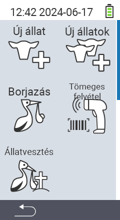

Prin intermediul elementului principal de meniu  `` ajungi la un submeniu, unde sunt prezentate 5 subelemente pentru selecție:

<map name="workmap">
  <area shape="rect" coords="3,40,116,160" alt="New animal" title="Cum să înregistrezi un animal nou folosind dispozitivul VitalControl&#10;Mouse click: deschide documentația" href="/en/docs/new/animal/">
  <area shape="rect" coords="3,160,116,280" alt="Calving" title="Cum să înregistrezi o fătare nouă folosind dispozitivul VitalControl&#10;Mouse click: deschide documentația" href="/en/docs/new/calving/">
  <area shape="rect" coords="3,280,116,399" alt="Animal loss" title="Cum să înregistrezi pierderea unui animal folosind dispozitivul VitalControl&#10;Mouse click: deschide documentația" href="/en/docs/new/animal-loss/">

  <area shape="rect" coords="116,40,230,160" alt="New animals" title="Cum să creezi mai multe animale noi pe dispozitivul VitalControl folosind o singură acțiune&#10;Mouse click: deschide documentația" href="/en/docs/new/animals/">
  <area shape="rect" coords="116,160,230,280" alt="Bulk recording" title="Folosește scannerul de coduri de bare pentru a înregistra o varietate de animale&#10;Mouse click: deschide documentația" href="/en/docs/new/bulk-recording/">

  <area shape="rect" coords="1,401,100,439" alt="Back" title="Revenire la nivelul anterior&#10;Mouse click: către documentație" href="/en/docs/menu/mainmenu/">
</map>

{}
Fiecare submeniu are propria sa pictogramă. Mutați cursorul mouse-ului peste o pictogramă din graficul de mai sus și lăsați-l să stea pentru un moment. Va apărea un tooltip, arătând informații pentru submeniul selectat. Dacă faceți clic pe una dintre pictograme, veți fi redirecționat către o descriere a elementului de submeniu selectat.
{}

