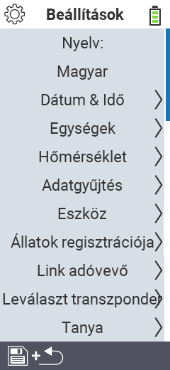

{}
Dacă faceți clic pe un element de meniu, veți fi redirecționat către o descriere a funcției respective.
{}

<map name="workmap">
  <area shape="rect" coords="2,40,230,120" alt="Limbă" title="Setați și stocați permanent limba interfeței de utilizator pe dispozitivul dvs. VitalControl&#10;Clic mouse: deschideți documentația" href="/en/docs/settings/language/">
  <area shape="rect" coords="2,120,230,160" alt="Dată și oră" title="Aici setați data și ora&#10;Clic mouse: deschideți documentația" href="/en/docs/settings/datetime/">
  <area shape="rect" coords="2,160,230,200" alt="Unități" title="Aici selectați unitățile pentru temperatură și masă&#10;Clic mouse: deschideți documentația" href="/en/docs/settings/units/">
  <area shape="rect" coords="2,200,230,240" alt="Temperatură" title="Setați setările de temperatură pentru aplicația dispozitivului dvs. VitalControl&#10;Clic mouse: deschideți documentația" href="/en/docs/settings/temperature/">
   <area shape="rect" coords="2,240,230,280" alt="Achiziție de date" title="Aici stocați informații relevante pentru colectarea datelor despre animale&#10;Clic mouse: deschideți documentația" href="/en/docs/settings/data-acquisition/">
   <area shape="rect" coords="2,280,230,320" alt="Dispozitiv" title="Aici puteți ajusta diverse setări ale dispozitivului&#10;Clic mouse: deschideți documentația" href="/en/docs/settings/device/">
   <area shape="rect" coords="2,320,230,360" alt="Înregistrarea animalelor" title="Aici puteți ajusta mai multe standarde setate din fabrică privind înregistrarea noilor animale la cerințele fermei dvs.&#10;Clic mouse: deschideți documentația" href="/en/docs/settings/animal-registration/">
   <area shape="rect" coords="2,360,230,400" alt="Legare transponder" title="Setați atribuirea transponderului pe dispozitivul dvs. VitalControl&#10;Clic mouse: deschideți documentația" href="/en/docs/settings/transponder-linkage/">
   <area shape="rect" coords="2,400,230,439" alt="Dezlegare transponder" title="Specificați cum va fi atribuit ID-ul animalului după ce transponderul este detașat&#10;Clic mouse: deschideți documentația" href="/en/docs/settings/transponder-linkage/">
   <area shape="rect" coords="2,440,230,480" alt="Fermă" title="Salvați permanent ID-ul național oficial de doisprezece cifre al fermei pe dispozitivul VitalControl&#10;Clic mouse: deschideți documentația" href="/en/docs/settings/farm-number/">
   <area shape="rect" coords="2,482,123,519" alt="Înapoi" title="Săriți înapoi un nivel" href="/en/docs/menu/mainmenu/">
</map>

