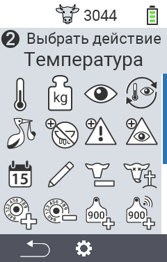
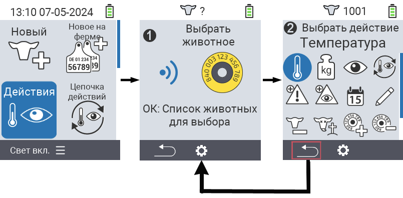
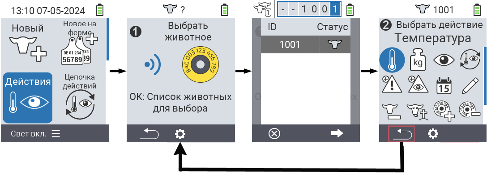

## Доступные действия

В зависимости от типа животного вы можете выполнить до 16 различных действий с животным.

<map name="workmap">
  <area shape="rect" coords="3,100,60,165" alt="Температура" title="Измерение температуры у животных&#10;Клик мыши: открыть документацию" href="/ru/docs/actions/measure-temperature/">
  <area shape="rect" coords="60,100,118,165" alt="Взвешивание" title="Запись веса животных&#10;Клик мыши: открыть документацию" href="/ru/docs/actions/record-weight/">
  <area shape="rect" coords="118,100,174,165" alt="Оценка" title="Оценка животных&#10;Клик мыши: открыть документацию" href="/ru/docs/actions/rating/">
  <area shape="rect" coords="174,100,230,165" alt="Цепочка действий" title="Применение и настройка цепочки действий&#10;Клик мыши: открыть документацию" href="/ru/docs/chain-of-actions/">
   <area shape="rect" coords="3,165,60,225" alt="Отел" title="Регистрация отела&#10;Клик мыши: открыть документацию" href="/ru/docs/actions/calving/">
   <area shape="rect" coords="60,165,120,225" alt="Запуск" title="Запуск коровы или добавление ее в список свежих коров&#10;Клик мыши: открыть документацию" href="/ru/docs/actions/dry-off/">
   <area shape="rect" coords="120,165,175,225" alt="Тревога" title="Добавление и удаление животных из списка тревоги&#10;Клик мыши: открыть документацию" href="/ru/docs/actions/alarm/">
   <area shape="rect" coords="175,165,230,225" alt="На контроле" title="Добавление животных в список на контроле или их удаление&#10;Клик мыши: открыть документацию" href="/ru/docs/actions/on-watch/">
   <area shape="rect" coords="3,225,60,280" alt="История животного" title="Просмотр истории животного&#10;Клик мыши: открыть документацию" href="/ru/docs/actions/animal-history/">
   <area shape="rect" coords="60,225,120,280" alt="Редактирование" title="Редактирование данных выбранного животного&#10;Клик мыши: открыть документацию" href="/ru/docs/actions/edit/">
   <area shape="rect" coords="120,225,175,280" alt="Снятие с учета" title="Снятие животного с учета&#10;Клик мыши: открыть документацию" href="/ru/docs/actions/unregister/">
   <area shape="rect" coords="175,225,230,280" alt="Потеря животного" title="Регистрация потери животного&#10;Клик мыши: открыть документацию" href="/ru/docs/actions/animal-loss/">
   <area shape="rect" coords="3,280,60,337" alt="Привязка транспондера" title="Присвоение транспондера животному&#10;Клик мыши: открыть документацию" href="/ru/docs/actions/link-transponder/">
   <area shape="rect" coords="55,280,120,337" alt="Отвязка транспондера" title="Удаление связи транспондера с животным&#10;Клик мыши: открыть документацию" href="/ru/docs/actions/unlink-transponder/">
   <area shape="rect" coords="120,280,175,337" alt="Ручное присвоение ID животного" title="Присвоение национального ID животному, у которого нет национального ID&#10;Клик мыши: открыть документацию" href="/ru/docs/actions/link-animal-id/#link-animal-id">
   <area shape="rect" coords="175,280,230,337" alt="Присвоение ID животного с помощью сканирования" title="Присвоение национального ID животному, у которого нет национального ID&#10;Клик мыши: открыть документацию" href="/ru/docs/actions/link-animal-id/#link-animal-id-with-electronic-ear-tag-scan">

<area shape="rect" coords="100,340,140,375" alt="Настройки" title="Вызов настроек&#10;Клик мыши: к документации" href="/ru/docs/actions/setting/">
</map>

{}
Каждое действие обозначено символом. Наведите указатель мыши на символ на графике ниже и подождите момент. Появится всплывающая подсказка с информацией о соответствующем действии. Если вы кликнете по одному из символов, вы будете перенаправлены на описание соответствующего действия.
{}

## Общая процедура

В меню  `Действия` вы можете в любое время выбрать следующее животное, не выходя из пункта меню Действия. Для выбора следующего животного поступите следующим образом:

1. Выберите пункт меню  `Действия` на главном экране вашего устройства VitalControl и нажмите кнопку `OK`.

2. Сканируйте животное с помощью транспондера или выберите животное из списка. Подтвердите нажатием `OK` и выберите животное с помощью кнопок со стрелками △ ▽. Подтвердите нажатием `OK`.

3. Откроется подменю, в котором вы найдете значки для множества действий с животными. Используйте кнопки со стрелками для выбора нужного действия и начните действие, нажав кнопку `OK`. В зависимости от выбранного действия появится один или несколько экранов или всплывающее окно.

4. Если хотите, теперь вы можете выбрать и выполнить другое действие для текущего животного.

5. После того как вы выполнили желаемое действие(я) для животного, вернитесь к шагу 2 'Выбор животного'. Для этого нажмите левую кнопку `F1` под символом `Назад` в левом нижнем углу нижнего колонтитула.

6. Окно из шага два снова откроется автоматически, и вы сможете выбрать следующее животное или вернуться в главное меню, нажав кнопку `F1` под символом `Назад`.



{}

{}
{}

{}

