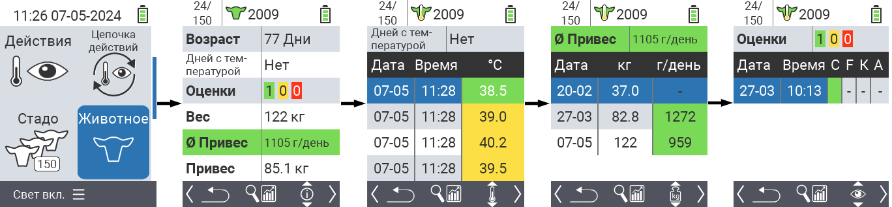
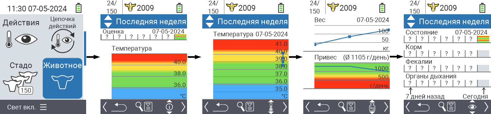
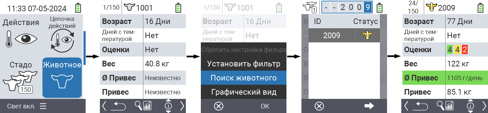
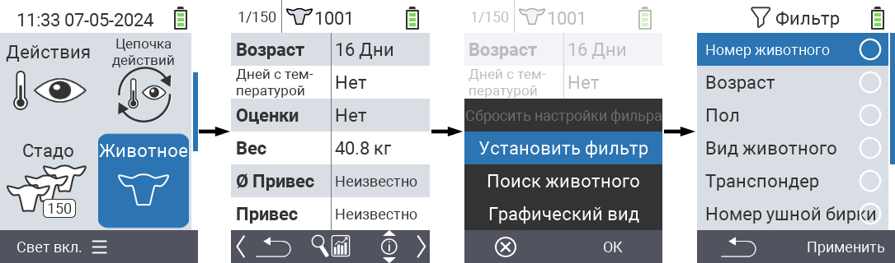

## Животное

Функция индивидуального животного позволяет просматривать важную информацию о весе, температуре и оценке каждого отдельного животного. У вас всегда есть возможность отображать информацию в виде графика или списка. Чтобы использовать функцию одного животного, выполните следующие действия:

1. На главном экране вашего устройства VitalControl выберите пункт меню  `Животное` и нажмите кнопку `OK`.

2. Открывается обзор наиболее важной информации о животных. Верхний край экрана показывает, какое животное вы сейчас просматриваете. Используйте клавишу `F3`, чтобы выбрать между информацией о животном , температурой , весом   и оценкой .

{}
В каждом режиме отображения информации у вас есть возможность [искать животное](#search-animal), устанавливать [фильтр](#set-filter) и переключаться на [графический вид](#set-graphical-view).
Вы также можете в любой момент переключаться между отдельными животными с помощью стрелок ◁ ▷.
{}

### Установка графического вида

1. Нажмите среднюю верхнюю кнопку `Вкл/Выкл` , чтобы открыть всплывающее меню. В этом меню вы можете выбрать функции `Установить фильтр`, `Искать животное` или `Графический вид`.

2. Выберите `Графический вид` с помощью стрелок △ ▽ и подтвердите нажатием `OK`.

### Поиск животного

1. Нажмите верхнюю среднюю кнопку `Вкл/Выкл`  для открытия всплывающего меню. В этом меню вы можете выбрать функции `Установить фильтр`, `Поиск животного` или `Графический вид`.

2. Выберите `Поиск животного` с помощью стрелок △ ▽ и подтвердите нажатием `OK`.

3. Используйте стрелки △ ▽ ◁ ▷ для выбора нужного номера животного и подтвердите нажатием `OK`.

### Установить фильтр

1. Нажмите верхнюю среднюю кнопку `Вкл/Выкл`  для открытия всплывающего меню. В этом меню вы можете выбрать функции `Установить фильтр`, `Поиск животного` или `Графический вид`.

2. Выберите `Установить фильтр` с помощью стрелок △ ▽ и подтвердите нажатием `OK`.
Инструкции по использованию фильтра можно найти [здесь]().

