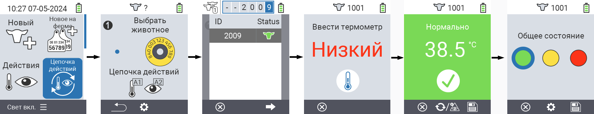
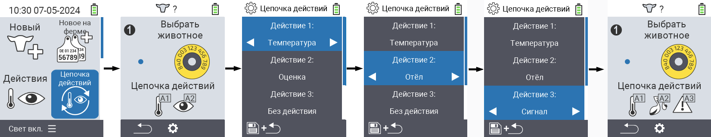

## Цепочка действий {#chain-of-actions}

Цепочка действий позволяет автоматически выполнять несколько действий с животным одно за другим. Например, вы можете выбрать действия `` и ``. Если затем выполнить цепочку действий, вы сначала можете измерить температуру животного, а сразу после этого записать оценку.
 
### Использование цепочки действий {#use-chain-of-actions}

1. На главном экране вашего устройства VitalControl выберите пункт меню &nbsp;&nbsp; `` и нажмите кнопку ``.

2. Либо сканируйте животное с помощью транспондера, либо подтвердите нажатием `` и используйте стрелки △ ▽ ◁ ▷ для ввода желаемого идентификатора животного.

3. Цепочка действий теперь выполняется. Как только все действия в цепочке действий будут выполнены, можно сразу выбрать следующее животное.



{}

{}
{}

{}


### Настройка цепочки действий {#set-chain-of-actions}

1. На главном экране вашего устройства VitalControl выберите пункт меню &nbsp;&nbsp; `` и нажмите кнопку ``.

2. Используйте кнопку `F2` &nbsp;&nbsp; (``).

3. Появится всплывающее окно. Используйте стрелки △ ▽ для выбора между перечисленными действиями 1 - 4 (вы можете выполнить до четырех действий подряд). Используйте стрелки ◁ ▷ для выбора желаемого действия для соответствующего действия. Сохраните настройки с помощью клавиши `F1` &nbsp;&nbsp;.

4. Если вы хотите сбросить всю цепочку действий, выберите опцию `` в подменю с помощью стрелок △ ▽ и подтвердите нажатием ``.

    

{}
В рамках отдельных действий у вас есть те же опции настройки, что описаны в главе [Действия](../actions) для каждого отдельного действия.
{}

{}
Символы на стартовом экране цепочки действий показывают, какие действия вы настроили и в каком порядке.
{}
