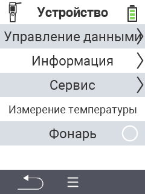

{}
Если вы нажмете на пункт меню, вы будете перенаправлены на описание соответствующей функции.
{}

<map name="workmap">
  <area shape="rect" coords="2,40,238,80" alt="Управление данными" title="Выполните резервное копирование данных, экспортируйте данные и сбросьте устройство&#10;Клик мыши: открыть документацию" href="/ru/docs/device/data-management/">
  <area shape="rect" coords="2,80,238,120" alt="Информация" title="Просмотрите важную информацию о программном и аппаратном обеспечении&#10;Клик мыши: открыть документацию" href="/ru/docs/device/info/">
  <area shape="rect" coords="2,120,238,160" alt="Сервис" title="Проверьте драйверы устройства, обновите прошивку и выполните тест дальности&#10;Клик мыши: открыть документацию" href="/ru/docs/device/service/">
  <area shape="rect" coords="2,160,238,200" alt="Измерение температуры" title="Проверьте измерение температуры вашего устройства&#10;Клик мыши: открыть документацию" href="/ru/docs/device/temperature-measurement/">
  <area shape="rect" coords="2,200,238,240" alt="Фонарик" title="Включите или выключите свет на вашем устройстве VitalControl&#10;Клик мыши: открыть документацию" href="/ru/docs/device/flashlight/">

  <area shape="rect" coords="2,282,97,318" alt="Назад" title="Вернуться на один уровень назад" href="/ru/docs/menu/mainmenu/">
</map>
