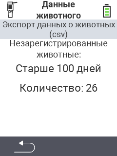

<map name="workmap">
  <area shape="rect" coords="2,40,238,80" alt="Экспорт данных о животных (csv)" title="Экспорт данных о животных&#10;Клик мышью: открыть документацию" href="/ru/docs/data-export/usb-drive/">

  <area shape="rect" coords="2,80,238,200" alt="Отмена регистрации животных" title="Укажите возраст, с которого следует отменять регистрацию животных&#10;Клик мышью: открыть документацию" href="/ru/docs/device/data-management/animal-data/unregister-animal/">

  <area shape="rect" coords="2,282,120,319" alt="Назад" title="Здесь вы найдете всю информацию и инструкции по экспорту данных о животных&#10;Клик мышью: открыть документацию" href="/ru/docs/device/data-management/">
</map>
