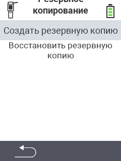

<map name="workmap">
  <area shape="rect" coords="2,40,238,80" alt="Создать резервную копию" title="Инструкции по созданию резервной копии можно найти здесь&#10;Клик мышью: открыть документацию" href="/ru/docs/backup/backup/">

  <area shape="rect" coords="2,80,238,120" alt="Восстановить резервную копию" title="Инструкции по восстановлению резервной копии можно найти здесь&#10;Клик мышью: открыть документацию" href="/ru/docs/backup/restore/">

  <area shape="rect" coords="2,282,120,319" alt="Назад" title="Перейти на один уровень назад&#10;Клик мышью: открыть документацию" href="/ru/docs/device/data-management/">
</map>
