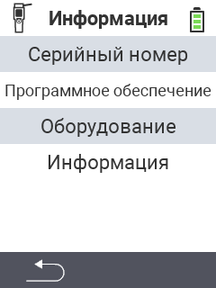

{}
Если вы нажмете на пункт меню, вы будете перенаправлены на описание соответствующей функции.
{}

<map name="workmap">
  <area shape="rect" coords="2,40,238,80" alt="Серийный номер" title="Чтобы получить серийный номер вашего устройства, нажмите здесь&#10;Клик мыши: к документации" href="/ru/docs/device/info/serial-number/">
  <area shape="rect" coords="2,80,238,120" alt="Программное обеспечение" title="Инструкции по просмотру версии вашего программного обеспечения можно найти здесь&#10;Клик мыши: к документации" href="/ru/docs/firmware/versions/">
  <area shape="rect" coords="2,120,238,160" alt="Аппаратное обеспечение" title="Для доступа к информации об аппаратном обеспечении вашего устройства нажмите здесь&#10;Клик мыши: к документации" href="/ru/docs/device/info/hardware/">
  <area shape="rect" coords="2,160,238,200" alt="О компании" title="Вызов информации о поставщике&#10;Клик мыши: к документации" href="/ru/docs/device/info/about/">

  <area shape="rect" coords="2,282,120,319" alt="Назад" title="Вернуться на уровень назад&#10;Клик мыши: открыть документацию" href="/ru/docs/device/">
</map>
