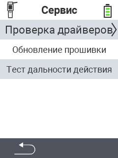

{}
Если вы нажмете на пункт меню, вы будете перенаправлены на описание соответствующей функции.
{}

<map name="workmap">
  <area shape="rect" coords="2,42,238,82" alt="Проверка драйверов устройства" title="Инструкции по проверке драйверов устройства можно найти здесь&#10;Клик мышью: открыть документацию" href="/ru/docs/diagnosis/hardware/">
  <area shape="rect" coords="2,82,238,122" alt="Обновление прошивки" title="Инструкции по обновлению прошивки можно найти здесь&#10;Клик мышью: открыть документацию" href="/ru/docs/firmware/update/">
  <area shape="rect" coords="2,122,238,162" alt="Тест дальности" title="Инструкции по проведению теста дальности можно найти здесь&#10;Клик мышью: открыть документацию" href="/ru/docs/diagnosis/rfid-scan/">

  <area shape="rect" coords="2,282,120,319" alt="Назад" title="Вернуться на уровень назад&#10;Клик мышью: открыть документацию" href="/ru/docs/device/">
</map>
