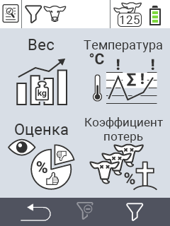

{}
Если вы нажмете на пункт меню, вы будете перенаправлены на описание соответствующей функции.
{}

<map name="workmap">
  <area shape="rect" coords="3,40,116,160" alt="Вес" title="Оцените ваши сохраненные данные в разделе Вес&#10;Клик мышью: открыть документацию" href="/ru/docs/evaluation/weight/">
  <area shape="rect" coords="3,160,116,279" alt="Рейтинг" title="Оцените ваши сохраненные данные в разделе рейтинга&#10;Клик мышью: открыть документацию" href="/ru/docs/evaluation/rating/">

  <area shape="rect" coords="116,40,238,160" alt="Температура" title="Оцените ваши сохраненные данные в разделе Температура&#10;Клик мышью: открыть документацию" href="/ru/docs/evaluation/temperature/">
  <area shape="rect" coords="116,160,238,279" alt="Смертность" title="Оцените ваши сохраненные данные в разделе смертности&#10;Клик мышью: открыть документацию" href="/ru/docs/evaluation/mortality/">

  <area shape="rect" coords="150,282,238,319" alt="Фильтр" title="Установить фильтр&#10;Клик мышью: к документации" href="/ru/docs/filter">
  <area shape="rect" coords="2,282,95,319" alt="Назад" title="Вернуться на один уровень назад&#10;Клик мышью: к документации" href="/ru/docs/menu/mainmenu/">
</map>
