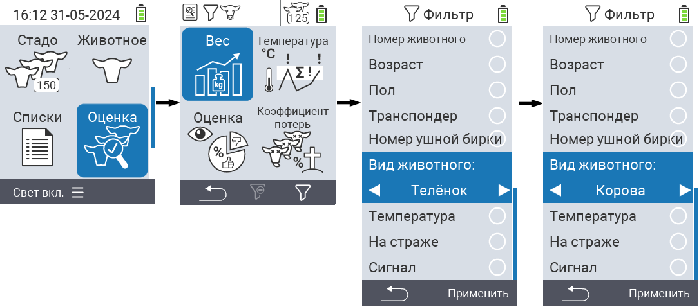
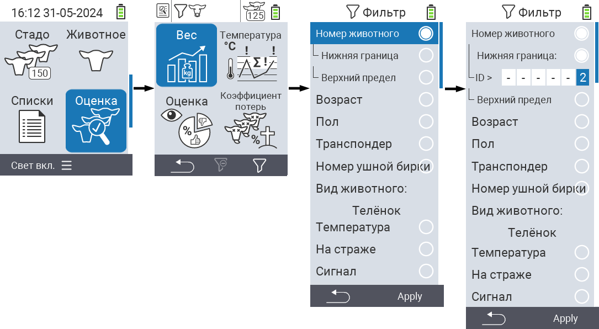
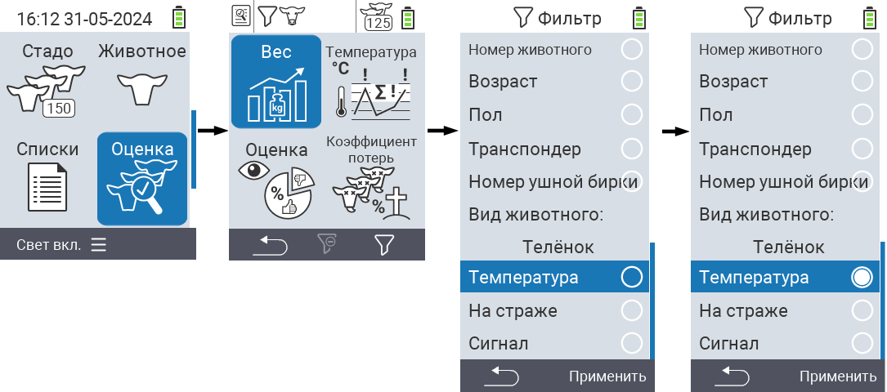

## Применение фильтров {#applying-filters}

{}
Фильтр помогает вам провести выборку, используя критерии фильтрации в пунктах меню ``, `` и `` устройства VitalControl. Как только вы примените фильтр, на верхней части экрана появятся символы различных критериев фильтрации. Эти символы помогают вам узнать, активированы ли и какие критерии фильтрации. Например, если вы установите фильтр `` на мужской, устройство будет использовать только мужских животных. Например, если вы также активируете фильтр ``, устройство будет использовать только мужских животных, которые находятся в списке наблюдения.
{}

Чтобы создать фильтр в оценках, выполните следующие действия:

1. В подменю, принадлежащем к верхнему пункту меню  `` нажмите клавишу `F3`  один раз. В подменю, принадлежащем к верхним пунктам меню  `` и  ``, вам нужно нажать клавишу дважды.

2. Откроется подменю, в котором вы можете установить все опции фильтрации. Вы можете фильтровать по ``, ``, ``, ``, ``, ``, ``, `` и ``.

3. Для фильтров ``, ``, `` и `` перейдите в соответствующую область и подтвердите с помощью ``. Используйте стрелки ◁ ▷ для указания желаемой настройки. Используйте клавишу `F3` `` для внедрения выбранной настройки. Чтобы отменить изменения фильтра, нажмите клавишу `F1` &nbsp;&nbsp;.

4. Для фильтров `` и `` выберите соответствующий критерий и подтвердите нажатием ``. Теперь вам будут показаны нижний и верхний пределы. Переместитесь к желаемому пределу с помощью стрелок △ ▽ и подтвердите нажатием `` дважды. Теперь вы можете установить желаемое значение с помощью стрелок ◁ ▷ и стрелок △ ▽. Когда все настройки будут верны, нажмите `` снова, чтобы выйти из режима настройки и применить выбранный(е) фильтр(ы) с помощью клавиши `F3` ``. Используя клавишу `F1` &nbsp;&nbsp;, вы можете отменить свои изменения, если это необходимо.

5. Для фильтров ``, `` и `` есть возможность отключить или включить их применение. Для этого выберите соответствующий фильтр и подтвердите нажатием ``. Фильтр теперь активен. Подтвердите снова нажатием ``, чтобы деактивировать фильтр.

6. После того как вы установили все фильтры, используйте клавишу `F3` ``, чтобы ввести в действие определенные фильтры, или нажмите клавишу `F1` , чтобы отменить ваши изменения в фильтр(ах).
