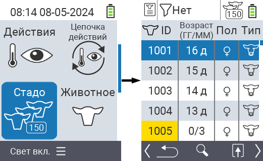
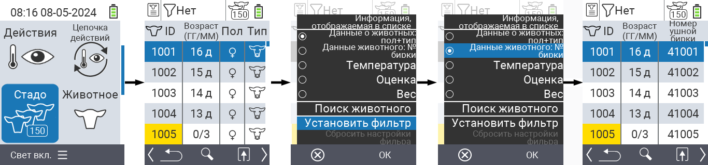
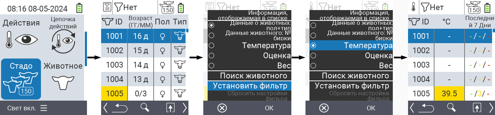
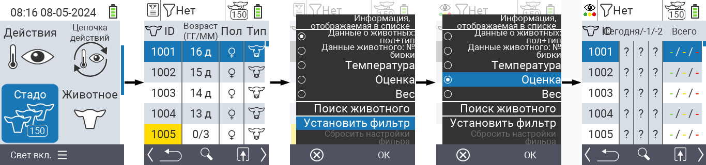
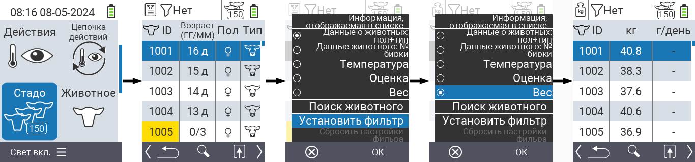
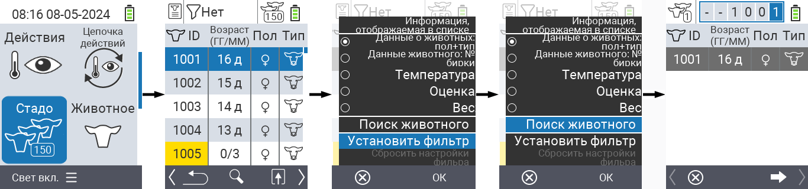
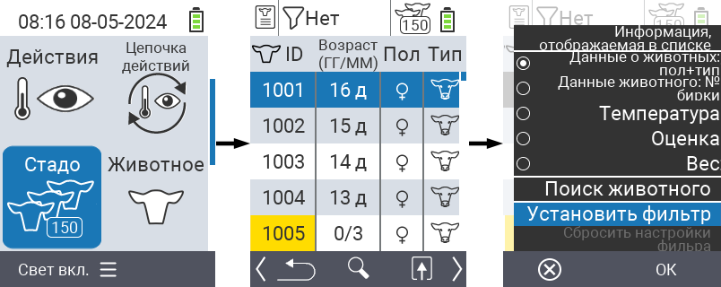
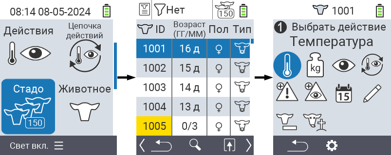

## Стадо {#herd}

В пункте меню "Стадо" вы можете просмотреть всё ваше стадо, найти отдельных животных и отобразить важную информацию. У вас есть следующие возможности:

- Просмотр [данных о животных](#view-animal-data)
- Просмотр [данных о температуре](#display-temperature)
- Просмотр [данных о рейтинге](#view-rating)
- Просмотр [данных о весе](#display-weight)
- [Поиск животного](#search-animal)
- Установка [фильтра](#set-filter)
- [Действия](#call-action-menu)

### Подготовительные шаги {#preparatory-steps}

1. На главном экране вашего устройства VitalControl выберите пункт меню  `` и нажмите кнопку ``.

2. Откроется обзор вашего стада.

    

### Просмотр данных о животных {#view-animal-data}

1. Выполните подготовительные шаги.

2. Используйте клавишу `F3` &nbsp;&nbsp; для вызова всплывающего меню, в котором перечислены категории информации, которые можно отобразить для списка стада. Используйте стрелки △ ▽ для выделения строки `` или `` и выберите эту категорию, нажав центральную кнопку `` или клавишу `F3` ``. Две опции выбора отличаются отображением информационной строки.

3. Данные о животных теперь будут отображаться в содержании списка стада.

4. Кроме того, вы можете использовать стрелки ◁ ▷ для переключения между различными вариантами отображения.

    

{}
По умолчанию сначала отображаются данные о животных. Только когда вы, например, отобразите вес, вам нужно будет снова установить отображение данных о животных.
{}

### Отображение температуры {#display-temperature}

1. Выполните подготовительные шаги.

2. Используйте клавишу `F3` &nbsp;&nbsp; для вызова всплывающего меню, которое отображает категории информации, доступные для списка стада. Используйте стрелки △ ▽ для выбора строки `` и выберите эту категорию, нажав центральную кнопку `` или клавишу `F3` ``.

3. Теперь данные о температуре будут отображаться в содержимом списка стада.

4. Кроме того, вы можете использовать стрелки ◁ ▷ для переключения между различными вариантами отображения.

    

### Просмотр рейтинга {#view-rating}

1. Выполните подготовительные шаги.

2. Используйте клавишу `F3` &nbsp;&nbsp; для вызова всплывающего меню, которое отображает категории информации, доступные для списка стада. Используйте стрелки △ ▽ для выбора строки `` и выберите эту категорию, нажав центральную кнопку `` или клавишу `F3` ``.

3. Теперь данные о рейтинге будут отображаться в содержимом списка стада.

4. Кроме того, вы можете использовать стрелки ◁ ▷ для переключения между различными вариантами отображения.

    

### Отображение веса {#display-weight}

1. Выполните подготовительные шаги.

2. Используйте клавишу `F3` &nbsp;&nbsp; для вызова всплывающего меню, которое отображает категории информации, доступные для списка стада. Используйте стрелки △ ▽ для выбора строки `` и выберите эту категорию, нажав центральную кнопку `` или клавишу `F3` ``.

3. Теперь данные о весе будут отображаться в содержимом списка стада.

4. Кроме того, вы можете использовать стрелки ◁ ▷ для переключения между различными вариантами отображения.

    

### Поиск животного {#search-animal}

1. Выполните подготовительные шаги.

2. Используйте клавишу `F3` &nbsp;&nbsp; для вызова всплывающего меню, которое отображает различные опции. Используйте стрелки △ ▽ для выбора функции `` и активируйте функцию поиска, нажав центральную кнопку `` или клавишу `F3` ``. Кроме того, вы можете использовать кнопку `On/Off`  сразу после первого шага.

3. Используйте стрелки △ ▽ ◁ ▷ для ввода номера желаемого животного и подтвердите нажатием ``.

    

### Установить фильтр {#set-filter}

1. Выполните подготовительные шаги.

2. Используйте клавишу `F3` &nbsp;&nbsp; для вызова всплывающего меню, которое предлагает различные опции. Используйте стрелки △ ▽ для выбора функции `` и активируйте функцию фильтра нажатием центральной клавиши `` или клавиши `F3` ``.

3. Как применить фильтр, можно узнать [здесь]().

    

### Вызвать меню действий {#call-action-menu}

У вас всегда есть возможность вызвать меню действий для животного.

1. Выполните подготовительные шаги.

2. Выберите животное из списка с помощью стрелок △ ▽ и подтвердите нажатием ``.

3. Теперь открыто меню действий. Как пользоваться этим можно узнать [здесь](../actions).

4. Вернитесь в список стада с помощью клавиши `F3`.

    
