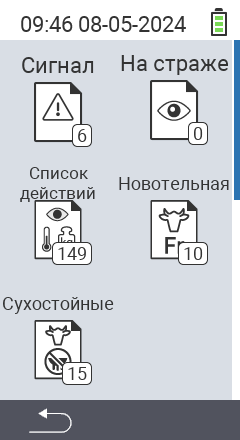

{}
Если вы нажмете на пункт меню, вы будете перенаправлены на описание соответствующей функции.
{}

<map name="workmap">
  <area shape="rect" coords="3,40,116,160" alt="Список тревог" title="Проверьте ваш список тревог&#10;Клик мыши: открыть документацию" href="/ru/docs/lists/alarm/">
  <area shape="rect" coords="3,160,116,280" alt="Список действий" title="Проверьте ваш список действий.&#10;Клик мыши: открыть документацию" href="/ru/docs/lists/actions/">
  <area shape="rect" coords="3,280,116,399" alt="Список сухостойных коров" title="Проверьте ваш список сухостойных коров&#10;Клик мыши: открыть документацию" href="/ru/docs/lists/dry-cows/">

  <area shape="rect" coords="116,40,230,160" alt="Список под наблюдением" title="Проверьте ваш список под наблюдением&#10;Клик мыши: открыть документацию" href="/ru/docs/lists/on-watch/">
  <area shape="rect" coords="116,160,230,280" alt="Список свежих коров" title="Проверьте ваш список свежих коров&#10;Клик мыши: открыть документацию" href="/ru/docs/lists/fresh-cows/">

  <area shape="rect" coords="2,401,115,438" alt="Назад" title="Вернуться на один уровень назад" href="/ru/docs/menu/mainmenu/">
</map>
