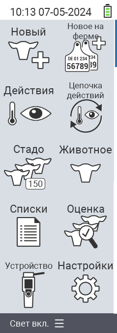

{}
Если вы нажмете на элемент меню, вы будете перенаправлены на описание соответствующей функции.
{}

<map name="workmap">
  <area shape="rect" coords="3,40,116,160" alt="Новое" title="Создать новых животных&#10;Клик мыши: открыть документацию" href="/ru/docs/new/">
  <area shape="rect" coords="3,160,116,280" alt="Действия" title="Действия с животными&#10;Клик мыши: открыть документацию" href="/ru/docs/actions/">
  <area shape="rect" coords="3,280,116,400" alt="Стадо" title="Меню стада&#10;Клик мыши: открыть документацию" href="/ru/docs/herd/">
  <area shape="rect" coords="3,400,116,520" alt="Списки" title="Списки животных&#10;Клик мыши: открыть документацию" href="/ru/docs/lists/">
  <area shape="rect" coords="3,520,116,634" alt="Устройство" title="Устройство&#10;Клик мыши: открыть документацию" href="/ru/docs/device/">

  <area shape="rect" coords="116,40,230,160" alt="Новое на ферме" title="Поступление животных&#10;Клик мыши: открыть документацию" href="/ru/docs/new-on-farm/">
  <area shape="rect" coords="116,160,230,280" alt="Цепочка действий" title="Цепочка действий&#10;Клик мыши: открыть документацию" href="/ru/docs/chain-of-actions/">
  <area shape="rect" coords="116,280,230,400" alt="Животное" title="Животное&#10;Клик мыши: открыть документацию" href="/ru/docs/animal/">
  <area shape="rect" coords="116,400,230,520" alt="Оценка" title="Оценка&#10;Клик мыши: открыть документацию" href="/ru/docs/evaluation/">
  <area shape="rect" coords="116,520,230,634" alt="Настройки" title="Настройки&#10;Клик мыши: открыть документацию" href="/ru/docs/settings/">
</map>
