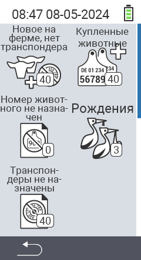

{}
Если вы нажмете на пункт меню, вы будете перенаправлены на описание соответствующей функции.
{}

<map name="workmap">
  <area shape="rect" coords="3,40,116,160" alt="Новое на ферме, без транспондера" title="Здесь вы назначаете транспондер новым животным без транспондера&#10;Клик мышью: открыть документацию" href="/ru/docs/new-on-farm/new-no-transponder/">
  <area shape="rect" coords="3,160,116,280" alt="Не назначен национальный идентификационный номер животного" title="Здесь вы можете просмотреть всех животных, которым еще не назначен национальный идентификационный номер, и назначить им национальный идентификационный номер&#10;Клик мышью: открыть документацию" href="/ru/docs/new-on-farm/no-national-animal-id-assigned/">
  <area shape="rect" coords="3,280,116,399" alt="Не назначен транспондер" title="Здесь вы можете просмотреть всех животных, которым еще не назначен транспондер, и назначить им транспондер&#10;Клик мышью: открыть документацию" href="/ru/docs/new-on-farm/no-transponder-assigned/">

  <area shape="rect" coords="116,40,230,160" alt="Купленные животные" title="Здесь вы можете просмотреть ваши текущие покупки и экспортировать данные&#10;Клик мышью: открыть документацию" href="/ru/docs/new-on-farm/purchased-animals/">
  <area shape="rect" coords="116,160,230,280" alt="Рождения" title="Здесь вы можете видеть ваши рождения и создать файл экспорта&#10;Клик мышью: открыть документацию" href="/ru/docs/new-on-farm/births/">
  <area shape="rect" coords="1,401,100,439" alt="Назад" title="Вернуться на один уровень назад&#10;Клик мышью: к документации" href="/ru/docs/menu/mainmenu/">
</map>
