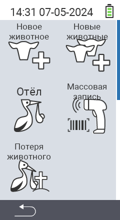

Через главный пункт меню  `Новое` вы попадаете в подменю, где представлено 5 подпунктов для выбора:

<map name="workmap">
  <area shape="rect" coords="3,40,116,160" alt="Новое животное" title="Как зарегистрировать новое животное с помощью устройства VitalControl&#10;Клик мышью: открыть документацию" href="/ru/docs/new/animal/">
  <area shape="rect" coords="3,160,116,280" alt="Отел" title="Как зарегистрировать новый отел с помощью устройства VitalControl&#10;Клик мышью: открыть документацию" href="/ru/docs/new/calving/">
  <area shape="rect" coords="3,280,116,399" alt="Потеря животного" title="Как зарегистрировать потерю животного с помощью устройства VitalControl&#10;Клик мышью: открыть документацию" href="/ru/docs/new/animal-loss/">

  <area shape="rect" coords="116,40,230,160" alt="Новые животные" title="Как создать несколько новых животных на устройстве VitalControl одним действием&#10;Клик мышью: открыть документацию" href="/ru/docs/new/animals/">
  <area shape="rect" coords="116,160,230,280" alt="Массовая запись" title="Используйте сканер штрих-кодов для регистрации различных животных&#10;Клик мышью: открыть документацию" href="/ru/docs/new/bulk-recording/">

  <area shape="rect" coords="1,401,100,439" alt="Назад" title="Вернуться на один уровень назад&#10;Клик мышью: к документации" href="/ru/docs/menu/mainmenu/">
</map>

{}
Каждый подпункт меню имеет свою иконку. Наведите указатель мыши на иконку на графике выше и подержите его на мгновение. Появится всплывающая подсказка, показывающая информацию для выбранного подменю. Если вы кликнете по одной из иконок, вы будете перенаправлены на описание выбранного подпункта меню.
{}
