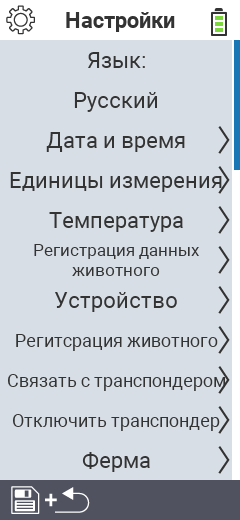

{}
Если вы нажмете на пункт меню, вы будете перенаправлены на описание соответствующей функции.
{}

<map name="workmap">
  <area shape="rect" coords="2,40,230,120" alt="Язык" title="Установите и сохраните язык интерфейса пользователя на вашем устройстве VitalControl&#10;Клик мыши: открыть документацию" href="/ru/docs/settings/language/">
  <area shape="rect" coords="2,120,230,160" alt="Дата и время" title="Здесь вы устанавливаете дату и время&#10;Клик мыши: открыть документацию" href="/ru/docs/settings/datetime/">
  <area shape="rect" coords="2,160,230,200" alt="Единицы измерения" title="Здесь вы выбираете единицы измерения температуры и массы&#10;Клик мыши: открыть документацию" href="/ru/docs/settings/units/">
  <area shape="rect" coords="2,200,230,240" alt="Температура" title="Установите настройки температуры для использования вашего устройства VitalControl&#10;Клик мыши: открыть документацию" href="/ru/docs/settings/temperature/">
   <area shape="rect" coords="2,240,230,280" alt="Сбор данных" title="Здесь вы сохраняете релевантную информацию для сбора данных о животных&#10;Клик мыши: открыть документацию" href="/ru/docs/settings/data-acquisition/">
   <area shape="rect" coords="2,280,230,320" alt="Устройство" title="Здесь вы можете настроить различные параметры устройства&#10;Клик мыши: к документации" href="/ru/docs/settings/device/">
   <area shape="rect" coords="2,320,230,360" alt="Регистрация животных" title="Здесь вы можете настроить несколько заводских стандартов, касающихся регистрации новых животных в соответствии с требованиями вашей фермы.&#10;Клик мыши: открыть документацию" href="/ru/docs/settings/animal-registration/">
   <area shape="rect" coords="2,360,230,400" alt="Связывание транспондера" title="Установите назначение транспондера на вашем устройстве VitalControl&#10;Клик мыши: открыть документацию" href="/ru/docs/settings/transponder-linkage/">
   <area shape="rect" coords="2,400,230,439" alt="Отвязка транспондера" title="Укажите, как будет присваиваться ID животного после снятия транспондера&#10;Клик мыши: открыть документацию" href="/ru/docs/settings/transponder-linkage/">
   <area shape="rect" coords="2,440,230,480" alt="Ферма" title="Постоянно сохраните ваш официальный двенадцатизначный национальный идентификационный номер фермы на устройстве VitalControl&#10;Клик мыши: открыть документацию" href="/ru/docs/settings/farm-number/">
   <area shape="rect" coords="2,482,123,519" alt="Назад" title="Вернуться на один уровень назад" href="/ru/docs/menu/mainmenu/">
</map>
