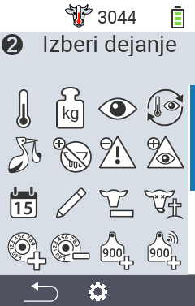
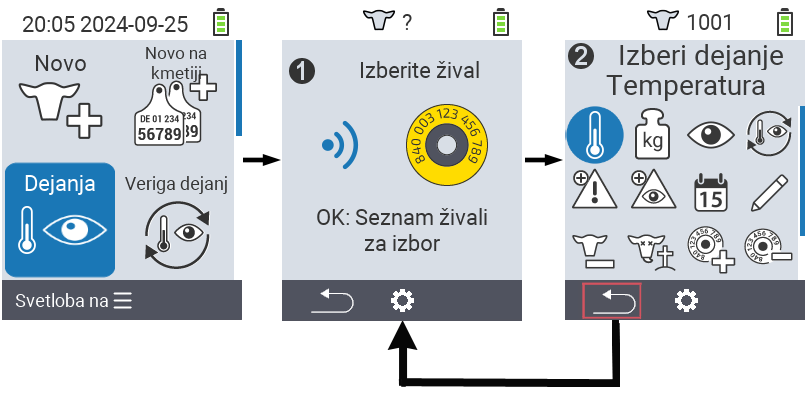
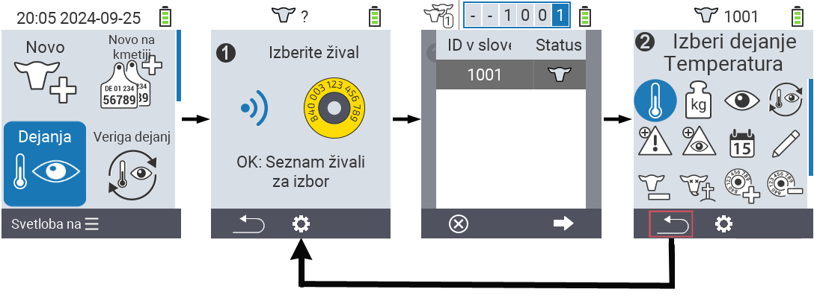

## Razpoložljiva dejanja {#available-actions}

Glede na vrsto živali lahko izvedete do 16 različnih dejanj na živali.

<map name="workmap">
  <area shape="rect" coords="3,100,60,165" alt="Temperatura" title="Merjenje vročine pri vaših živalih&#10;Klik z miško: odpri dokumentacijo" href="/sl/docs/actions/measure-temperature/">
  <area shape="rect" coords="60,100,118,165" alt="Tehtanje" title="Zabeležite težo vaših živali&#10;Klik z miško: odpri dokumentacijo" href="/sl/docs/actions/record-weight/">
  <area shape="rect" coords="118,100,174,165" alt="Ocenjevanje" title="Ocenite vaše živali&#10;Klik z miško: odpri dokumentacijo" href="/sl/docs/actions/rating/">
  <area shape="rect" coords="174,100,230,165" alt="Veriga dejanj" title="Uporaba in nastavitev verige dejanj&#10;Klik z miško: odpri dokumentacijo" href="/sl/docs/chain-of-actions/">
   <area shape="rect" coords="3,165,60,225" alt="Telitev" title="Registracija telitve&#10;Klik z miško: odpri dokumentacijo" href="/sl/docs/actions/calving/">
   <area shape="rect" coords="60,165,120,225" alt="Sušenje" title="Sušenje krave ali dodajanje na seznam svežih krav&#10;Klik z miško: odpri dokumentacijo" href="/sl/docs/actions/dry-off/">
   <area shape="rect" coords="120,165,175,225" alt="Alarm" title="Dodajanje in odstranjevanje živali s seznama alarmov&#10;Klik z miško: odpri dokumentacijo" href="/sl/docs/actions/alarm/">
   <area shape="rect" coords="175,165,230,225" alt="Opazovanje" title="Dodajanje živali na seznam opazovanja ali odstranjevanje z njega&#10;Klik z miško: odpri dokumentacijo" href="/sl/docs/actions/on-watch/">
   <area shape="rect" coords="3,225,60,280" alt="Zgodovina živali" title="Ogled zgodovine živali&#10;Klik z miško: odpri dokumentacijo" href="/sl/docs/actions/animal-history/">
   <area shape="rect" coords="60,225,120,280" alt="Urejanje" title="Urejanje podatkov izbrane živali&#10;Klik z miško: odpri dokumentacijo" href="/sl/docs/actions/edit/">
   <area shape="rect" coords="120,225,175,280" alt="Odjava" title="Odjava živali&#10;Klik z miško: odpri dokumentacijo" href="/sl/docs/actions/unregister/">
   <area shape="rect" coords="175,225,230,280" alt="Izguba živali" title="Registracija izgube živali&#10;Klik z miško: odpri dokumentacijo" href="/sl/docs/actions/animal-loss/">
   <area shape="rect" coords="3,280,60,337" alt="Povezava transponderja" title="Dodelitev transponderja živali&#10;Klik z miško: odpri dokumentacijo" href="/sl/docs/actions/link-transponder/">
   <area shape="rect" coords="55,280,120,337" alt="Odstranitev povezave transponderja" title="Odstranitev povezave transponderja z živaljo&#10;Klik z miško: odpri dokumentacijo" href="/sl/docs/actions/unlink-transponder/">
   <area shape="rect" coords="120,280,175,337" alt="Ročna povezava ID živali" title="Dodelitev nacionalnega ID živali živali, ki nima nacionalnega ID živali&#10;Klik z miško: odpri dokumentacijo" href="/sl/docs/actions/link-animal-id/#link-animal-id">
   <area shape="rect" coords="175,280,230,337" alt="Povezava ID živali s skeniranjem" title="Dodelitev nacionalnega ID živali živali, ki nima nacionalnega ID živali&#10;Klik z miško: odpri dokumentacijo" href="/sl/docs/actions/link-animal-id/#link-animal-id-with-electronic-ear-tag-scan">

<area shape="rect" coords="100,340,140,375" alt="Settings" title="Call up the settings&#10;Mouse click: to the documentation" href="/sl/docs/actions/setting/">
</map>

{}
Vsako dejanje je označeno s simbolom. Premaknite kazalec miške nad simbol v spodnji grafiki in ga za trenutek zadržite. Pojavi se pojavno okno, ki prikazuje informacije o ustreznem dejanju. Če kliknete na enega od simbolov, boste preusmerjeni na opis ustreznega dejanja.
{}

## Splošni postopek {#general-procedure}

V meniju  `` lahko kadar koli izberete naslednjo žival, ne da bi morali zapustiti meni Dejanje. Za izbiro naslednje živali sledite naslednjim korakom:

1. Izberite meni  `` na glavnem zaslonu vaše naprave VitalControl in pritisnite gumb ``.

2. Žival bodisi skenirajte s transponderjem ali izberite iz seznama. Potrdite s pritiskom na `` in izberite žival s pomočjo puščičnih gumbov △ ▽. Potrdite z ``.

3. Odpre se podmeni, v katerem boste našli ikone za številna dejanja z živalmi. S puščičnimi gumbi izberite želeno dejanje in začnite dejanje s pritiskom na gumb ``. Glede na izbrano dejanje se bo prikazal eden ali več zaslonov ali pojavno okno.

4. Če želite, lahko zdaj izberete in izvedete drugo dejanje za trenutno žival.

5. Ko izvedete želeno dejanje(a) za žival, se vrnite na korak 2 'Izbira živali'. To storite tako, da pritisnete levi gumb `F1` pod simbolom `` v spodnjem levem kotu noge.

6. Okno iz drugega koraka se bo samodejno ponovno odprlo in lahko izberete naslednjo žival ali se vrnete v glavni meni s pritiskom na gumb `F1` pod simbolom ``.



{}

{}
{}

{}


