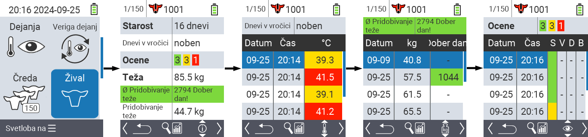
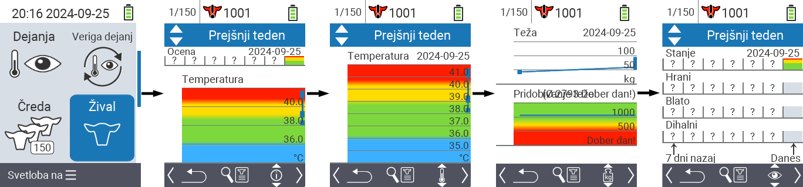
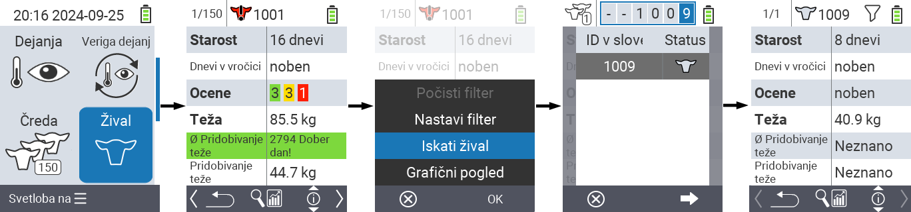
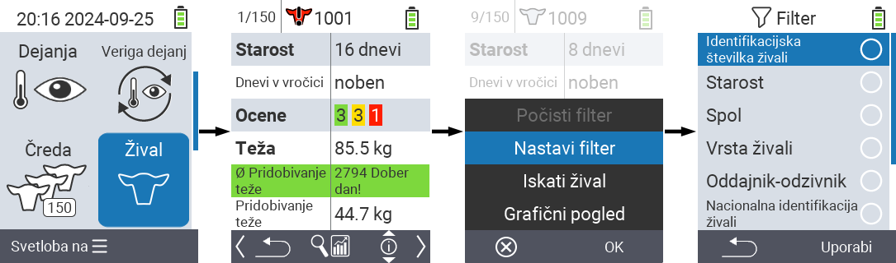

## Žival {#animal}

Funkcija posamezne živali vam omogoča ogled pomembnih informacij o teži, temperaturi in oceni za vsako posamezno žival. Vedno imate možnost prikaza informacij kot grafiko ali kot seznam. Za uporabo funkcije posamezne živali sledite naslednjim korakom:

1. Na glavnem zaslonu vaše naprave VitalControl izberite meni  `` in pritisnite gumb ``.

2. Odpre se pregled najpomembnejših informacij o živalih. Zgornji rob zaslona vam pokaže, katero žival trenutno gledate. S tipko `F3` izbirate med informacijami o živalih , temperaturo , težo  in oceno .

{}
Znotraj vsakega prikaza informacij imate možnost [iskanja živali](#search-animal), nastavitve [filtra](#set-filter) in preklopa na [grafični prikaz](#set-graphical-view).
Prav tako lahko kadarkoli preklapljate med posameznimi živalmi s pomočjo puščičnih tipk ◁ ▷.
{}

### Nastavitev grafičnega prikaza {#set-graphical-view}

1. Pritisnite zgornji srednji gumb `On/Off`  za odprtje pojavno menija. V tem meniju lahko izbirate med funkcijami ``, `` ali ``.

2. Izberite `` s puščičnimi tipkami △ ▽ in potrdite z ``.

### Iskanje živali {#search-animal}

1. Pritisnite zgornji srednji gumb `On/Off`  za odprtje pojavnega menija. V tem meniju lahko izbirate med funkcijami ``, `` ali ``.

2. Izberite `` s puščičnimi tipkami △ ▽ in potrdite z ``.

3. Uporabite puščične tipke △ ▽ ◁ ▷ za izbiro želenega številke živali in potrdite z ``

### Nastavitev filtra {#set-filter}

1. Pritisnite zgornji srednji gumb `On/Off`  za odprtje pojavnega menija. V tem meniju lahko izbirate med funkcijami ``, `` ali ``.

2. Izberite `` s puščičnimi tipkami △ ▽ in potrdite z ``.
Navodila za uporabo filtra lahko dobite [tukaj]().

