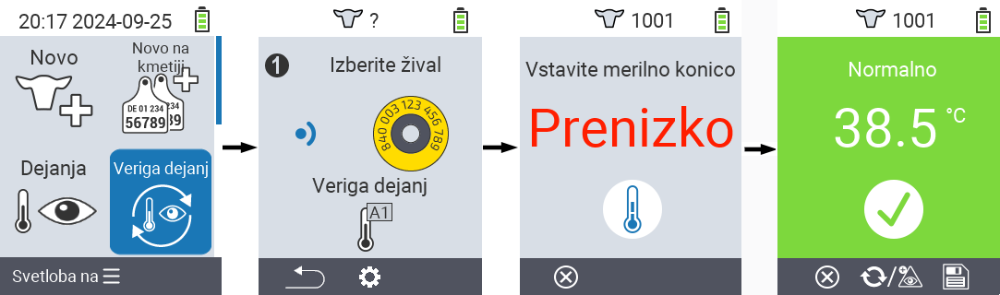
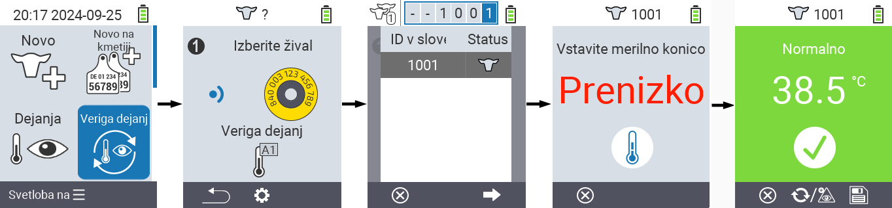
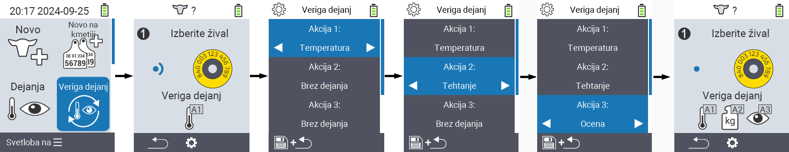

## Veriga dejanj {#chain-of-actions}

Veriga dejanj vam omogoča, da samodejno izvedete več dejanj za žival eno za drugim. Na primer, lahko izberete dejanja `` in ``. Če nato izvedete verigo dejanj, lahko najprej izmerite temperaturo svoje živali in takoj zatem zabeležite oceno.

### Uporaba verige dejanj {#use-chain-of-actions}

1. Na glavnem zaslonu vaše naprave VitalControl izberite meni &nbsp;&nbsp; `` in pritisnite gumb ``.

2. Bodisi skenirajte žival z uporabo transponderja ali potrdite z `` in uporabite smerne tipke △ ▽ ◁ ▷ za vnos želene ID živali.

3. Veriga dejanj se zdaj izvaja. Takoj ko so vsa dejanja v verigi dejanj izvedena, lahko neposredno izberete naslednjo žival.



{}

{}
{}

{}


### Nastavitev verige dejanj {#set-chain-of-actions}

1. Na glavnem zaslonu vaše naprave VitalControl izberite meni &nbsp;&nbsp; `` in pritisnite gumb ``.

2. Uporabite gumb `F2` &nbsp;&nbsp; (``).

3. Pojavi se prekrivni zaslon. Uporabite puščične tipke △ ▽ za izbiro med navedenimi dejanji 1 - 4 (lahko izvedete do štiri dejanja zapored). Uporabite puščične tipke ◁ ▷ za izbiro želenega dejanja za posamezno dejanje. Shranite nastavitve s tipko `F1` &nbsp;&nbsp;.

4. Če želite ponastaviti celotno verigo dejanj, izberite možnost `` v podmeniju z uporabo puščičnih tipk △ ▽ in potrdite z ``.

    

{}
Znotraj posameznih dejanj imate enake možnosti nastavitve, kot so opisane v poglavju [Dejanja](../actions) za vsako posamezno dejanje.
{}

{}
Simboli na začetnem zaslonu verige dejanj prikazujejo, katera dejanja ste nastavili in v kakšnem vrstnem redu.
{}
