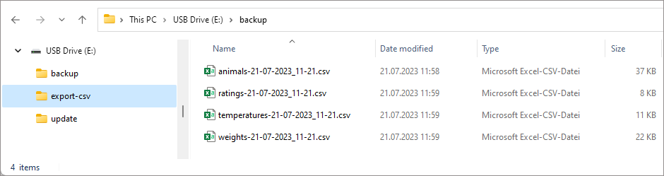
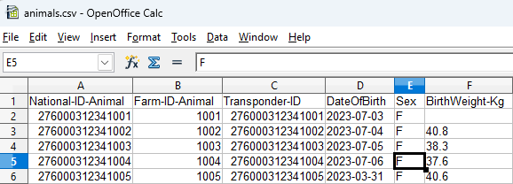

Postopek za izvoz podatkov iz VitalControl na masovno shranjevalno napravo vašega računalnika:

### Povežite VitalControl z računalnikom {#connect-vitalcontrol-to-pc}

1. Povežite napravo VitalControl z vašim računalnikom ali prenosnikom preko priloženega USB kabla.

   

1. Prepričajte se, da je vaša naprava VitalControl vklopljena.

### Izvedite izvoz podatkov {#perform-data-export}

1. Pritisnite tipko Windows za odprtje menija Start

1. *Samo Windows 11*: Kliknite gumb `Vse aplikacije`

1. V seznamu nameščenih aplikacij se pomaknite navzdol do črke `U`. Tam bi morali najti vnos menija `Urban VitalControl`. Po potrebi razširite ta vnos, da se prikažejo vsi podvnosni vnosi.

   {}
Če vnosa `Urban VitalControl` ne najdete na seznamu aplikacij, boste morda morali najprej [namestiti](../vcsynchronizer/installation/) programsko opremo `VCSynchronizer` na vaš računalnik.
   {}

1. Kliknite na vnos menija `Izvoz podatkov (CVS)`.

   

1. Postopek izvoza se začne. Ko je izvoz podatkov končan, se odpre okno Raziskovalca, ki prikazuje lokalni podatkovni imenik s štirimi na novo ustvarjenimi [izvoznimi datotekami](../../data-export/export-files/).

   

   {}
  Vsako od teh štirih [izvoznih datotek](../../data-export/export-files/) lahko odprete v programu za preglednice po vaši izbiri (kot sta [Microsoft Excel](https://products.office.com/excel) ali [OpenOffice Calc](https://www.openoffice.org/)) in tam izvedete napredno analizo podatkov. Kot primer je spodaj prikazan pogled tabele `animals.csv` v programu za preglednice:

  
   {}
