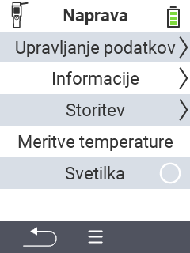

{}
Če kliknete na element menija, boste preusmerjeni na opis ustrezne funkcije.
{}

<map name="workmap">
  <area shape="rect" coords="2,40,238,80" alt="Upravljanje podatkov" title="Izvedite varnostne kopije podatkov, izvozite svoje podatke in ponastavite napravo&#10;Klik z miško: odprite dokumentacijo" href="/sl/docs/device/data-management/">
  <area shape="rect" coords="2,80,238,120" alt="Informacije" title="Oglejte si pomembne informacije o programski in strojni opremi&#10;Klik z miško: odprite dokumentacijo" href="/sl/docs/device/info/">
  <area shape="rect" coords="2,120,238,160" alt="Servis" title="Preverite gonilnike naprave, posodobite svojo programsko opremo in izvedite test dosega&#10;Klik z miško: odprite dokumentacijo" href="/sl/docs/device/service/">
  <area shape="rect" coords="2,160,238,200" alt="Merjenje temperature" title="Preizkusite merjenje temperature vaše naprave&#10;Klik z miško: odprite dokumentacijo" href="/sl/docs/device/temperature-measurement/">
  <area shape="rect" coords="2,200,238,240" alt="Svetilka" title="Vklopite ali izklopite luč na vaši napravi VitalControl&#10;Klik z miško: odprite dokumentacijo" href="/sl/docs/device/flashlight/">

  <area shape="rect" coords="2,282,97,318" alt="Nazaj" title="Skočite nazaj za eno raven" href="/sl/docs/menu/mainmenu/">
</map>
