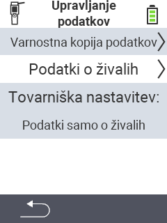

{}
Če kliknete na element menija, boste preusmerjeni na opis ustrezne funkcije.
{}

<map name="workmap">
  <area shape="rect" coords="2,40,238,80" alt="Varnostna kopija podatkov" title="Navodila za ustvarjanje varnostne kopije najdete tukaj&#10;Klik z miško: odpri dokumentacijo" href="/sl/docs/device/data-management/data-backup/">

  <area shape="rect" coords="2,80,238,120" alt="Podatki o živalih" title="Navodila za obnovitev varnostne kopije najdete tukaj&#10;Klik z miško: odpri dokumentacijo" href="/sl/docs/device/data-management/animal-data/">

  <area shape="rect" coords="2,120,238,200" alt="Tovarniška ponastavitev" title="Vse informacije in navodila za ponastavitev naprave in podatkov o živalih najdete tukaj&#10;Klik z miško: odpri dokumentacijo" href="/sl/docs/reset/">

  <area shape="rect" coords="2,282,120,319" alt="Nazaj" title="Vse informacije in navodila za izvoz podatkov o živalih najdete tukaj&#10;Klik z miško: odpri dokumentacijo" href="/sl/docs/device/">
</map>
