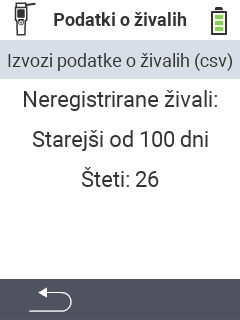

<map name="workmap">
  <area shape="rect" coords="2,40,238,80" alt="Izvoz podatkov o živalih (csv)" title="Izvozite svoje podatke o živalih&#10;Klik z miško: odprite dokumentacijo" href="/sl/docs/data-export/usb-drive/">

  <area shape="rect" coords="2,80,238,200" alt="Odjava živali" title="Določite starost, pri kateri naj se živali odjavijo&#10;Klik z miško: odprite dokumentacijo" href="/sl/docs/device/data-management/animal-data/unregister-animal/">

  <area shape="rect" coords="2,282,120,319" alt="Nazaj" title="Vse informacije in navodila za izvoz podatkov o živalih najdete tukaj&#10;Klik z miško: odprite dokumentacijo" href="/sl/docs/device/data-management/">
</map>
