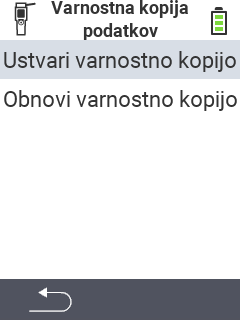

<map name="workmap">
  <area shape="rect" coords="2,40,238,80" alt="Ustvari varnostno kopijo" title="Navodila za ustvarjanje varnostne kopije najdete tukaj&#10;Klik z miško: odpri dokumentacijo" href="/sl/docs/backup/backup/">

  <area shape="rect" coords="2,80,238,120" alt="Obnovi varnostno kopijo" title="Navodila za obnovitev varnostne kopije najdete tukaj&#10;Klik z miško: odpri dokumentacijo" href="/sl/docs/backup/restore/">

  <area shape="rect" coords="2,282,120,319" alt="Nazaj" title="Skoči nazaj za eno raven&#10;Klik z miško: odpri dokumentacijo" href="/sl/docs/device/data-management/">
</map>
