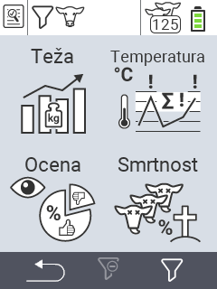

{}
Če kliknete na element menija, boste preusmerjeni na opis ustrezne funkcije.
{}

<map name="workmap">
  <area shape="rect" coords="3,40,116,160" alt="Teža" title="Ocenite svoje shranjene podatke v razdelku Teža&#10;Klik z miško: odpri dokumentacijo" href="/sl/docs/evaluation/weight/">
  <area shape="rect" coords="3,160,116,279" alt="Ocena" title="Ocenite svoje shranjene podatke v razdelku Ocena&#10;Klik z miško: odpri dokumentacijo" href="/sl/docs/evaluation/rating/">

  <area shape="rect" coords="116,40,238,160" alt="Temperatura" title="Ocenite svoje shranjene podatke v razdelku Temperatura&#10;Klik z miško: odpri dokumentacijo" href="/sl/docs/evaluation/temperature/">
  <area shape="rect" coords="116,160,238,279" alt="Umrljivost" title="Ocenite svoje shranjene podatke v razdelku Umrljivost&#10;Klik z miško: odpri dokumentacijo" href="/sl/docs/evaluation/mortality/">

  <area shape="rect" coords="150,282,238,319" alt="Filter" title="Nastavite filter&#10;Klik z miško: do dokumentacije" href="/sl/docs/filter">
  <area shape="rect" coords="2,282,95,319" alt="Nazaj" title="Skočite nazaj na eno raven&#10;Klik z miško: do dokumentacije" href="/sl/docs/menu/mainmenu/">
</map>
