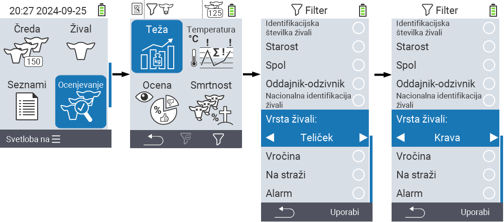
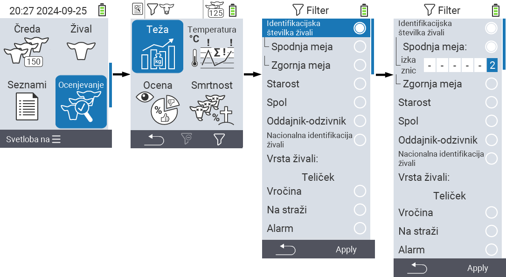
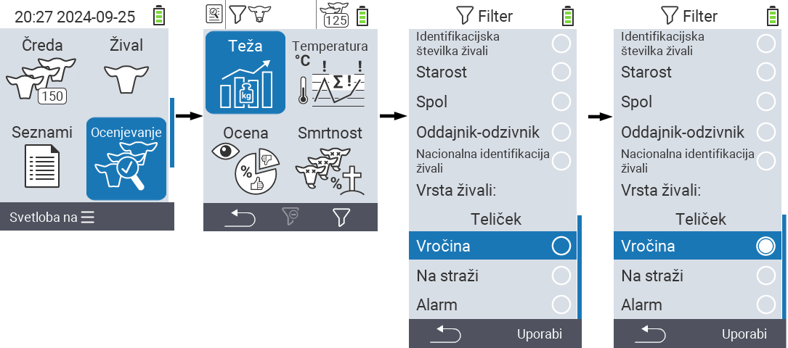

## Uporaba filtrov {#applying-filters}

{}
Filter vam pomaga izvesti izbor z uporabo filtrov v menijskih postavkah ``, `` in `` naprave VitalControl. Takoj ko uporabite filter, se na vrhu zaslona prikažejo simboli za različna merila filtra. Ti simboli vam pomagajo ugotoviti, ali in katera merila filtra so aktivirana. Na primer, če nastavite filter `` na moški, bo naprava uporabila samo moške živali. Če na primer aktivirate tudi filter ``, bo naprava uporabila samo moške živali, ki so na seznamu opazovanja.
{}

Za ustvarjanje filtra v ocenah sledite naslednjim korakom:

1. V podmeniju, ki pripada zgornji menijski postavki  `` pritisnite tipko `F3`  enkrat. V podmeniju, ki pripada zgornjim menijskim postavkam  `` in  ``, morate pritisniti tipko dvakrat.

2. Odpre se podmeni, v katerem lahko nastavite vse možnosti filtra. Filtrirate lahko po ``, ``, ``, ``, ``, ``, ``, `` in ``.

3. Za filtre ``, ``, `` in `` se pomaknite na ustrezno območje in potrdite z ``. Uporabite puščične tipke ◁ ▷ za določitev želene nastavitve. Uporabite tipko `F3` `` za uveljavitev izbrane nastavitve. Če želite zavreči spremembe filtra, pritisnite tipko `F1` &nbsp;&nbsp;.

4. Za filtre `` in `` izberite ustrezno merilo in potrdite z ``. Zdaj vam bo prikazana spodnja in zgornja meja. Do želene meje se pomikajte s puščičnimi tipkami △ ▽ in potrdite s pritiskom na `` dvakrat. Zdaj lahko nastavite želeno številko s puščičnimi tipkami ◁ ▷ in puščičnimi tipkami △ ▽. Ko so vse nastavitve pravilne, ponovno pritisnite ``, da zapustite način nastavitve in uporabite izbrani filter(e) s tipko `F3` ``. S tipko `F1` &nbsp;&nbsp; lahko po želji zavrnete spremembe.

5. Za filtre ``, `` in `` obstaja možnost onemogočanja ali omogočanja njihove uporabe. Če želite to narediti, izberite ustrezen filter in potrdite z ``. Filter je zdaj aktiven. Ponovno potrdite z ``, da deaktivirate filter.

6. Ko nastavite vse filtre, uporabite tipko `F3` ``, da nastavite določene filtre, ali pritisnite tipko `F1`  za zavrnitev sprememb filtrov.
