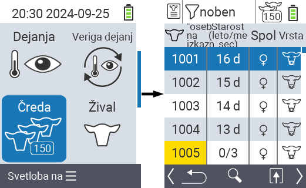
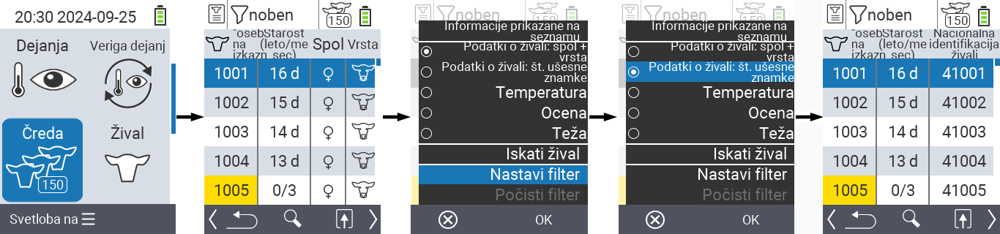
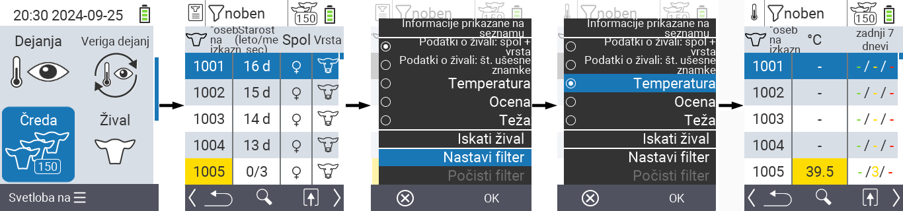
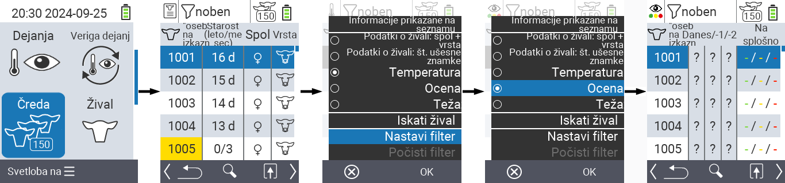
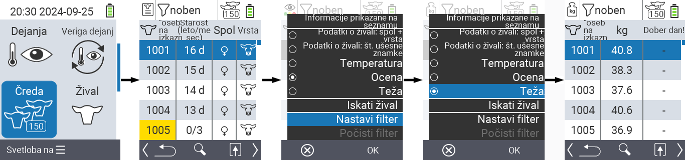
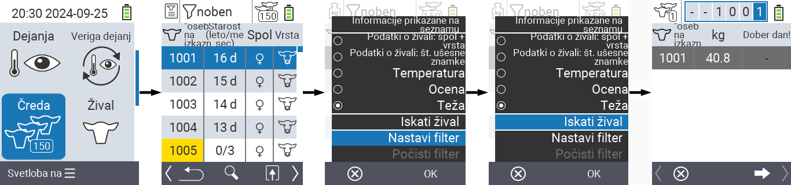
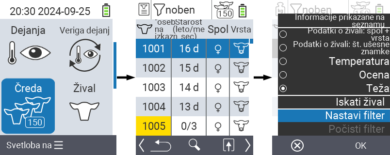
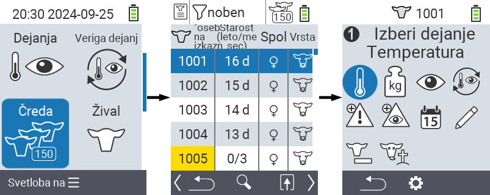

## Čreda {#herd}

V meniju Čreda lahko pregledate celotno čredo, iščete posamezne živali in prikažete pomembne informacije. Na voljo imate naslednje možnosti:

- Oglejte si [podatke o živalih](#view-animal-data)
- Oglejte si [podatke o temperaturi](#display-temperature)
- Oglejte si [podatke o oceni](#view-rating)
- Oglejte si [podatke o teži](#view-rating)
- [Išči žival](#search-animal)
- Nastavite [filter](#set-filter)
- [Dejanja](#call-action-menu)

### Pripravljalni koraki {#preparatory-steps}

1. Na glavnem zaslonu vaše naprave VitalControl izberite meni  `` in pritisnite gumb ``.

2. Odpre se pregled vaše črede.

    

### Oglejte si podatke o živalih {#view-animal-data}

1. Izvedite pripravljalne korake.

2. Uporabite tipko `F3` &nbsp;&nbsp; za priklic pojavnega menija, ki navaja kategorije informacij, ki jih je mogoče prikazati za seznam črede. Uporabite puščične tipke △ ▽ za označitev vrstice `` ali `` in izberite to kategorijo s pritiskom na osrednji gumb `` ali tipko `F3` ``. Obe možnosti izbire se razlikujeta v prikazu informacijskega traku.

3. Podatki o živalih bodo zdaj prikazani kot vsebina seznama črede.

4. Alternativno lahko uporabite puščične tipke ◁ ▷ za preklapljanje med različnimi možnostmi prikaza.

    

{}
Privzeto so najprej prikazani podatki o živalih. Šele ko imate na primer prikazano težo, morate znova nastaviti prikaz podatkov o živalih.
{}

### Prikaz temperature {#display-temperature}

1. Dokončajte pripravljalne korake.

2. Uporabite tipko `F3` &nbsp;&nbsp; za priklic pojavnega menija, ki navaja kategorije informacij, ki jih je mogoče prikazati za seznam črede. Uporabite puščične tipke △ ▽ za označitev vrstice `` in izberite to kategorijo s pritiskom na osrednji gumb `` ali tipko `F3` ``.

3. Podatki o temperaturi bodo zdaj prikazani kot vsebina seznama črede.

4. Alternativno lahko uporabite puščične tipke ◁ ▷ za preklapljanje med različnimi možnostmi prikaza.

    

### Ogled ocene {#view-rating}

1. Dokončajte pripravljalne korake.

2. Uporabite tipko `F3` &nbsp;&nbsp; za priklic pojavnega menija, ki navaja kategorije informacij, ki jih je mogoče prikazati za seznam črede. Uporabite puščične tipke △ ▽ za označitev vrstice `` in izberite to kategorijo s pritiskom na osrednji gumb `` ali tipko `F3` ``.

3. Podatki o oceni bodo zdaj prikazani kot vsebina seznama črede.

4. Alternativno lahko uporabite puščične tipke ◁ ▷ za preklapljanje med različnimi možnostmi prikaza.

    

### Prikaz teže {#display-weight}

1. Dokončajte pripravljalne korake.

2. Uporabite tipko `F3` &nbsp;&nbsp; za priklic pojavnega menija, ki navaja kategorije informacij, ki jih je mogoče prikazati za seznam črede. Uporabite puščične tipke △ ▽ za označitev vrstice `` in izberite to kategorijo s pritiskom na osrednji gumb `` ali tipko `F3` ``.

3. Podatki o teži bodo zdaj prikazani kot vsebina seznama črede.

4. Alternativno lahko uporabite puščične tipke ◁ ▷ za preklapljanje med različnimi možnostmi prikaza.

### Iskanje živali {#search-animal}

1. Izvedite pripravljalne korake.

2. Uporabite tipko `F3` &nbsp;&nbsp; za priklic pojavnega menija, ki navaja različne možnosti. Uporabite puščične tipke △ ▽ za označitev funkcije `` in zaženite iskalno funkcijo s pritiskom na osrednjo tipko `` ali tipko `F3` ``. Alternativno lahko uporabite gumb `On/Off`  takoj po prvem koraku.

3. Uporabite puščične tipke △ ▽ ◁ ▷ za vnos želene številke živali in potrdite z ``.

### Nastavitev filtra {#set-filter}

1. Izvedite pripravljalne korake.

2. Uporabite tipko `F3` &nbsp;&nbsp; za priklic pojavnega menija, ki navaja različne možnosti. Uporabite puščične tipke △ ▽ za označitev funkcije `` in zaženite funkcijo filtra s pritiskom na osrednjo tipko `` ali tipko `F3` ``.

3. Kako uporabiti filter, lahko najdete [tukaj]().

### Klic akcijskega menija {#call-action-menu}

Vedno imate možnost priklicati akcijski meni za žival.

1. Izvedite pripravljalne korake.

2. Izberite žival s seznama s puščičnimi tipkami △ ▽ in potrdite z ``.

3. Akcijski meni je zdaj odprt. Kako ga uporabiti, lahko najdete [tukaj](../actions).

4. Vrnite se na seznam črede s tipko `F3`.

