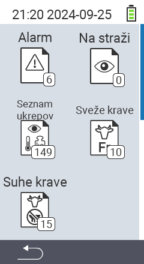

{}
Če kliknete na element menija, boste preusmerjeni na opis ustrezne funkcije.
{}

<map name="workmap">
  <area shape="rect" coords="3,40,116,160" alt="Seznam alarmov" title="Preverite svoj seznam alarmov&#10;Klik z miško: odpri dokumentacijo" href="/sl/docs/lists/alarm/">
  <area shape="rect" coords="3,160,116,280" alt="Seznam akcij" title="Preverite svoj seznam akcij&#10;Klik z miško: odpri dokumentacijo" href="/sl/docs/lists/actions/">
  <area shape="rect" coords="3,280,116,399" alt="Seznam suhih krav" title="Preverite svoj seznam suhih krav&#10;Klik z miško: odpri dokumentacijo" href="/sl/docs/lists/dry-cows/">

  <area shape="rect" coords="116,40,230,160" alt="Seznam opazovanja" title="Preverite svoj seznam opazovanja&#10;Klik z miško: odpri dokumentacijo" href="/sl/docs/lists/on-watch/">
  <area shape="rect" coords="116,160,230,280" alt="Sveže krave" title="Preverite svoj seznam svežih krav&#10;Klik z miško: odpri dokumentacijo" href="/sl/docs/lists/fresh-cows/">

  <area shape="rect" coords="2,401,115,438" alt="Nazaj" title="Skoči nazaj za eno raven" href="/sl/docs/menu/mainmenu/">
</map>
