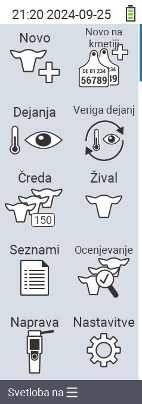

{}
Če kliknete na element menija, boste preusmerjeni na opis ustrezne funkcije.
{}

<map name="workmap">
  <area shape="rect" coords="3,40,116,160" alt="Novo" title="Ustvari nove živali&#10;Klik z miško: odpri dokumentacijo" href="/sl/docs/new/">
  <area shape="rect" coords="3,160,116,280" alt="Dejanja" title="Dejanja na živalih&#10;Klik z miško: odpri dokumentacijo" href="/sl/docs/actions/">
  <area shape="rect" coords="3,280,116,400" alt="Čreda" title="Meni črede&#10;Klik z miško: odpri dokumentacijo" href="/sl/docs/herd/">
  <area shape="rect" coords="3,400,116,520" alt="Seznami" title="Seznami živali&#10;Klik z miško: odpri dokumentacijo" href="/sl/docs/lists/">
  <area shape="rect" coords="3,520,116,634" alt="Naprava" title="Naprava&#10;Klik z miško: odpri dokumentacijo" href="/sl/docs/device/">

  <area shape="rect" coords="116,40,230,160" alt="Novo na kmetiji" title="Dostop do živali&#10;Klik z miško: odpri dokumentacijo" href="/sl/docs/new-on-farm/">
  <area shape="rect" coords="116,160,230,280" alt="Veriga dejanj" title="Veriga dejanj&#10;Klik z miško: odpri dokumentacijo" href="/sl/docs/chain-of-actions/">
  <area shape="rect" coords="116,280,230,400" alt="Žival" title="Žival&#10;Klik z miško: odpri dokumentacijo" href="/sl/docs/animal/">
  <area shape="rect" coords="116,400,230,520" alt="Ocena" title="Ocena&#10;Klik z miško: odpri dokumentacijo" href="/sl/docs/evaluation/">
  <area shape="rect" coords="116,520,230,634" alt="Nastavitve" title="Nastavitve&#10;Klik z miško: odpri dokumentacijo" href="/sl/docs/settings/">
</map>
