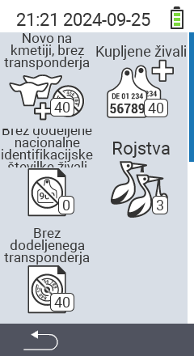

{}
Če kliknete na element menija, boste preusmerjeni na opis ustrezne funkcije.
{}

<map name="workmap">
  <area shape="rect" coords="3,40,116,160" alt="Novo na kmetiji, brez transponderja" title="Tukaj dodelite transponder novim živalim brez transponderja&#10;Klik z miško: odpri dokumentacijo" href="/sl/docs/new-on-farm/new-no-transponder/">
  <area shape="rect" coords="3,160,116,280" alt="Ni dodeljena nacionalna ID živali" title="Tukaj si lahko ogledate vse živali, ki še niso bile dodeljene nacionalni ID živali, in jim dodelite nacionalno ID živali&#10;Klik z miško: odpri dokumentacijo" href="/sl/docs/new-on-farm/no-national-animal-id-assigned/">
  <area shape="rect" coords="3,280,116,399" alt="Ni dodeljen transponder" title="Tukaj si lahko ogledate vse živali, ki še niso bile dodeljene transponderju, in jim dodelite transponder&#10;Klik z miško: odpri dokumentacijo" href="/sl/docs/new-on-farm/no-transponder-assigned/">

  <area shape="rect" coords="116,40,230,160" alt="Kupljene živali" title="Tukaj si lahko ogledate svoje trenutne nakupe in izvozite podatke&#10;Klik z miško: odpri dokumentacijo" href="/sl/docs/new-on-farm/purchased-animals/">
  <area shape="rect" coords="116,160,230,280" alt="Rojstva" title="Tukaj si lahko ogledate svoja rojstva in ustvarite izvozno datoteko&#10;Klik z miško: odpri dokumentacijo" href="/sl/docs/new-on-farm/births/">
  <area shape="rect" coords="1,401,100,439" alt="Nazaj" title="Skoči nazaj na eno raven&#10;Klik z miško: na dokumentacijo" href="/sl/docs/menu/mainmenu/">
</map>
