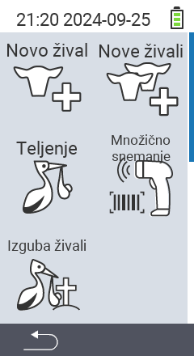

Preko glavnega menija  `` pridete do podmenija, kjer je na voljo 5 podpostavk za izbiro:

<map name="workmap">
  <area shape="rect" coords="3,40,116,160" alt="Nova žival" title="Kako registrirati novo žival z uporabo naprave VitalControl&#10;Klik z miško: odpri dokumentacijo" href="/sl/docs/new/animal/">
  <area shape="rect" coords="3,160,116,280" alt="Telitev" title="Kako registrirati novo telitev z uporabo naprave VitalControl&#10;Klik z miško: odpri dokumentacijo" href="/sl/docs/new/calving/">
  <area shape="rect" coords="3,280,116,399" alt="Izguba živali" title="Kako registrirati izgubo živali z uporabo naprave VitalControl&#10;Klik z miško: odpri dokumentacijo" href="/sl/docs/new/animal-loss/">

  <area shape="rect" coords="116,40,230,160" alt="Nove živali" title="Kako ustvariti več novih živali na napravi VitalControl z eno samo akcijo&#10;Klik z miško: odpri dokumentacijo" href="/sl/docs/new/animals/">
  <area shape="rect" coords="116,160,230,280" alt="Skupinsko snemanje" title="Uporabite čitalnik črtne kode za snemanje različnih živali&#10;Klik z miško: odpri dokumentacijo" href="/sl/docs/new/bulk-recording/">

  <area shape="rect" coords="1,401,100,439" alt="Nazaj" title="Skoči nazaj za eno raven&#10;Klik z miško: do dokumentacije" href="/sl/docs/menu/mainmenu/">
</map>

{}
Vsak podmeni ima svojo ikono. Premaknite kazalec miške nad ikono v zgornji grafiki in ga za trenutek pustite tam. Pojavi se pojavno okno, ki prikazuje informacije za izbrani podmeni. Če kliknete na eno od ikon, boste preusmerjeni na opis izbrane podpostavke menija.
{}

