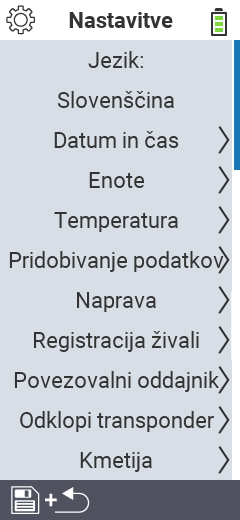

{}
Če kliknete na element menija, boste preusmerjeni na opis ustrezne funkcije.
{}

<map name="workmap">
  <area shape="rect" coords="2,40,230,120" alt="Jezik" title="Nastavite in trajno shranite jezik uporabniškega vmesnika na vaši napravi VitalControl&#10;Klik z miško: odpri dokumentacijo" href="/sl/docs/settings/language/">
  <area shape="rect" coords="2,120,230,160" alt="Datum in čas" title="Tukaj nastavite datum in čas&#10;Klik z miško: odpri dokumentacijo" href="/sl/docs/settings/datetime/">
  <area shape="rect" coords="2,160,230,200" alt="Enote" title="Tukaj izberete enote za temperaturo in maso&#10;Klik z miško: odpri dokumentacijo" href="/sl/docs/settings/units/">
  <area shape="rect" coords="2,200,230,240" alt="Temperatura" title="Nastavite temperaturne nastavitve za uporabo vaše naprave VitalControl&#10;Klik z miško: odpri dokumentacijo" href="/sl/docs/settings/temperature/">
   <area shape="rect" coords="2,240,230,280" alt="Zbiranje podatkov" title="Tukaj shranite ustrezne informacije za zbiranje podatkov o živalih&#10;Klik z miško: odpri dokumentacijo" href="/sl/docs/settings/data-acquisition/">
   <area shape="rect" coords="2,280,230,320" alt="Naprava" title="Tukaj lahko prilagodite različne nastavitve naprave&#10;Klik z miško: odpri dokumentacijo" href="/sl/docs/settings/device/">
   <area shape="rect" coords="2,320,230,360" alt="Registracija živali" title="Tukaj lahko prilagodite več tovarniško nastavljenih standardov glede registracije novih živali zahtevam vaše kmetije.&#10;Klik z miško: odpri dokumentacijo" href="/sl/docs/settings/animal-registration/">
   <area shape="rect" coords="2,360,230,400" alt="Povezava transponderja" title="Nastavite dodelitev transponderja na vaši napravi VitalControl&#10;Klik z miško: odpri dokumentacijo" href="/sl/docs/settings/transponder-linkage/">
   <area shape="rect" coords="2,400,230,439" alt="Odstranitev transponderja" title="Določite, kako bo dodeljena ID živali po odstranitvi transponderja&#10;Klik z miško: odpri dokumentacijo" href="/sl/docs/settings/transponder-linkage/">
   <area shape="rect" coords="2,440,230,480" alt="Kmetija" title="Trajno shranite svojo uradno dvanajstmestno nacionalno ID kmetije na napravi VitalControl&#10;Klik z miško: odpri dokumentacijo" href="/sl/docs/settings/farm-number/">
   <area shape="rect" coords="2,482,123,519" alt="Nazaj" title="Skoči nazaj na eno raven" href="/sl/docs/menu/mainmenu/">
</map>

