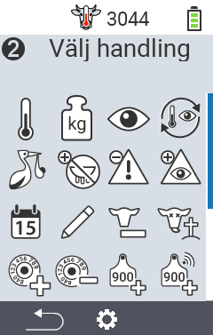
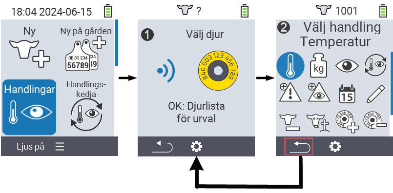
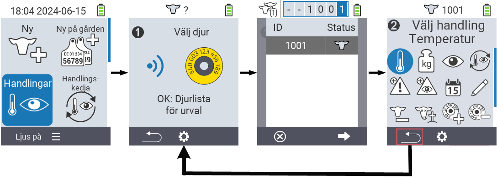

## Tillgängliga åtgärder {#available-actions}

Beroende på djurtypen kan du utföra upp till 16 olika åtgärder för ett djur.

<map name="workmap">
  <area shape="rect" coords="3,100,60,165" alt="Temperatur" title="Mät feber hos dina djur&#10;Mus klick: öppna dokumentation" href="/sv/docs/actions/measure-temperature/">
  <area shape="rect" coords="60,100,118,165" alt="Vägning" title="Registrera vikten på dina djur&#10;Mus klick: öppna dokumentation" href="/sv/docs/actions/record-weight/">
  <area shape="rect" coords="118,100,174,165" alt="Betyg" title="Betygsätt dina djur&#10;Mus klick: öppna dokumentation" href="/sv/docs/actions/rating/">
  <area shape="rect" coords="174,100,230,165" alt="Åtgärdskedja" title="Tillämpa och ställa in åtgärdskedjan&#10;Mus klick: öppna dokumentation" href="/sv/docs/chain-of-actions/">
   <area shape="rect" coords="3,165,60,225" alt="Kalvning" title="Registrera en kalvning&#10;Mus klick: öppna dokumentation" href="/sv/docs/actions/calving/">
   <area shape="rect" coords="60,165,120,225" alt="Sinläggning" title="Sinlägga en ko eller lägga till henne på listan över nykalvade kor&#10;Mus klick: öppna dokumentation" href="/sv/docs/actions/dry-off/">
   <area shape="rect" coords="120,165,175,225" alt="Larm" title="Lägg till och ta bort djur från larmlistan&#10;Mus klick: öppna dokumentation" href="/sv/docs/actions/alarm/">
   <area shape="rect" coords="175,165,230,225" alt="Under bevakning" title="Lägg till djur på bevakningslistan eller ta bort dem&#10;Mus klick: öppna dokumentation" href="/sv/docs/actions/on-watch/">
   <area shape="rect" coords="3,225,60,280" alt="Djurhistorik" title="Visa ett djurs historik&#10;Mus klick: öppna dokumentation" href="/sv/docs/actions/animal-history/">
   <area shape="rect" coords="60,225,120,280" alt="Redigera" title="Redigera data för det valda djuret&#10;Mus klick: öppna dokumentation" href="/sv/docs/actions/edit/">
   <area shape="rect" coords="120,225,175,280" alt="Avregistrera" title="Avregistrera ett djur&#10;Mus klick: öppna dokumentation" href="/sv/docs/actions/unregister/">
   <area shape="rect" coords="175,225,230,280" alt="Djurförlust" title="Registrera en djurförlust&#10;Mus klick: öppna dokumentation" href="/sv/docs/actions/animal-loss/">
   <area shape="rect" coords="3,280,60,337" alt="Länka transponder" title="Tilldela en transponder till ett djur&#10;Mus klick: öppna dokumentation" href="/sv/docs/actions/link-transponder/">
   <area shape="rect" coords="55,280,120,337" alt="Ta bort transponderlänk" title="Ta bort transponderlänken till ett djur&#10;Mus klick: öppna dokumentation" href="/sv/docs/actions/unlink-transponder/">
   <area shape="rect" coords="120,280,175,337" alt="Länka djur-ID manuellt" title="Tilldela ett nationellt djur-ID till ett djur som inte har ett nationellt djur-ID&#10;Mus klick: öppna dokumentation" href="/sv/docs/actions/link-animal-id/#link-animal-id">
   <area shape="rect" coords="175,280,230,337" alt="Länka djur-ID med skanning" title="Tilldela ett nationellt djur-ID till ett djur som inte har ett nationellt djur-ID&#10;Mus klick: öppna dokumentation" href="/sv/docs/actions/link-animal-id/#link-animal-id-with-electronic-ear-tag-scan">

   <area shape="rect" coords="100,340,140,375" alt="Inställningar" title="Öppna inställningarna&#10;Mus klick: till dokumentationen" href="/sv/docs/actions/setting/">
</map>

{}
Varje åtgärd identifieras av en symbol. Flytta muspekaren över en symbol i grafiken nedan och låt den vila en stund. En verktygstips visas, som presenterar information om respektive åtgärd. Om du klickar på en av symbolerna, kommer du att vidarebefordras till en beskrivning av respektive åtgärd.
{}

## Allmän procedur {#general-procedure}

Inom menyn   `` kan du när som helst välja nästa djur utan att behöva lämna menyalternativet Åtgärder. För att välja nästa djur, gör följande:

1. Välj menyalternativet   `` på huvudskärmen på din VitalControl-enhet och tryck på ``-knappen.

2. Antingen skanna ett djur med hjälp av transpondern eller välj ett djur från listan. Bekräfta genom att trycka på `` och välj ett djur med hjälp av piltangenterna △ ▽. Bekräfta med ``.

3. En undermeny öppnas där du hittar ikoner för många djuråtgärder. Använd piltangenterna för att välja önskad åtgärd och starta åtgärden genom att trycka på ``-knappen. Beroende på vald åtgärd kommer en eller flera skärmar eller ett popup-fönster att visas.

4. Om så önskas kan du nu välja och utföra en annan åtgärd för det aktuella djuret.

5. Efter att du har utfört önskad(a) åtgärd(er) för djuret, återgå till steg 2 'Djurval'. För att göra detta, tryck på den vänstra knappen `F1` under ``-symbolen i det nedre vänstra hörnet av foten.

6. Fönstret från steg två öppnas igen automatiskt och du kan välja nästa djur eller återgå till huvudmenyn genom att trycka på `F1`-knappen under ``-symbolen.



{}

{}
{}

{}


