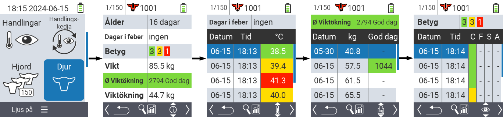
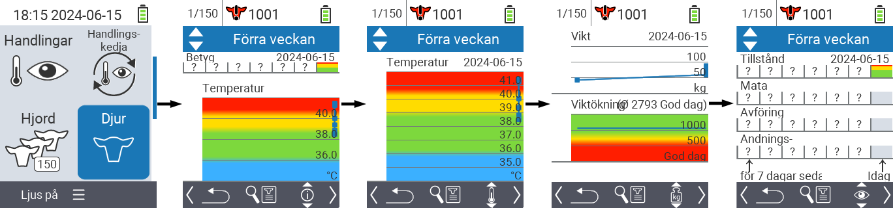
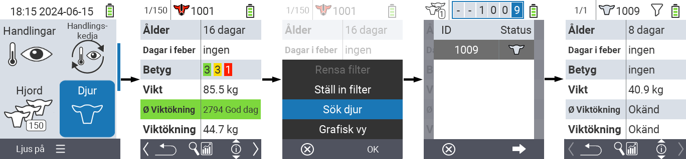
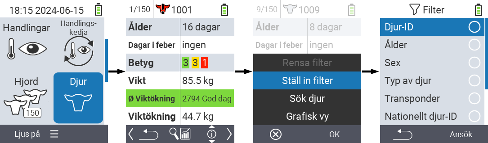

## Djur {#animal}

Funktionen för enskilda djur låter dig visa viktig information om vikt, temperatur och betyg för varje enskilt djur. Du har alltid möjlighet att visa informationen som en graf eller som en lista. För att använda funktionen för enskilda djur, gör följande:

1. På huvudskärmen på din VitalControl-enhet, välj menyalternativet  `` och tryck på knappen ``.

2. En översikt över den viktigaste djurinformationen öppnas. Den övre kanten av skärmen visar vilket djur du för närvarande tittar på. Använd `F3`-tangenten för att välja mellan djurinformation , temperatur , vikt  och betyg .

{}
Inom varje informationsvisning har du möjlighet att [söka efter ett djur](#search-animal), ställa in ett [filter](#set-filter) och växla till en [grafisk vy](#set-graphical-view).
Du kan också när som helst växla mellan de enskilda djuren med hjälp av piltangenterna ◁ ▷.
{}

### Ställ in grafisk vy {#set-graphical-view}

1. Tryck på den övre mittre `På/Av`-knappen  för att öppna en popup-meny. I denna meny kan du välja mellan funktionerna ``, ``, eller ``.

2. Välj `` med piltangenterna △ ▽ och bekräfta med ``.

### Sök djur {#search-animal}

1. Tryck på den övre mitten `On/Off` knappen  för att öppna en popup-meny. I denna meny kan du välja mellan funktionerna ``, ``, eller ``.

2. Välj `` med piltangenterna △ ▽ och bekräfta med ``.

3. Använd piltangenterna △ ▽ ◁ ▷ för att välja önskat djurnummer och bekräfta med ``

### Ställ in filter {#set-filter}

1. Tryck på den övre mitten `On/Off` knappen  för att öppna en popup-meny. I denna meny kan du välja mellan funktionerna ``, ``, eller ``.

2. Välj `` med piltangenterna △ ▽ och bekräfta med ``.
Du kan få instruktioner om hur du använder filtret [här]().

