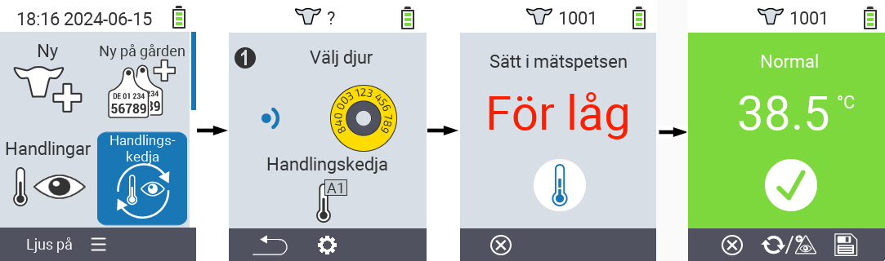
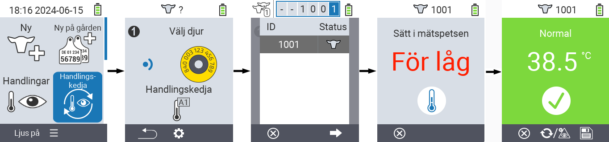
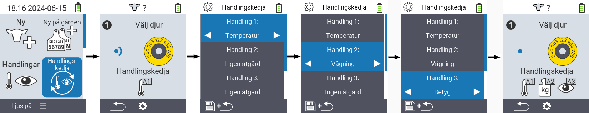

## Kedja av åtgärder {#chain-of-actions}

Åtgärdskedjan låter dig automatiskt utföra flera åtgärder för ett djur en efter en. Till exempel kan du välja åtgärderna `` och ``. Om du sedan utför åtgärdskedjan kan du först ta djurets temperatur och omedelbart därefter registrera betyget.

### Använd kedja av åtgärder {#use-chain-of-actions}

1. På huvudskärmen på din VitalControl-enhet, välj menyalternativet &nbsp;&nbsp; `` och tryck på knappen ``.

2. Antingen skanna ett djur med transpondern eller bekräfta med `` och använd piltangenterna △ ▽ ◁ ▷ för att ange önskat djur-ID.

3. Kedjan av åtgärder utförs nu. Så snart alla åtgärder i åtgärdskedjan har utförts kan nästa djur väljas direkt.



{}

{}
{}

{}


### Ställ in kedja av åtgärder {#set-chain-of-actions}

1. På huvudskärmen på din VitalControl-enhet, välj menyalternativet &nbsp;&nbsp; `` och tryck på knappen ``.

2. Använd knappen `F2` &nbsp;&nbsp; (``).

3. En överlagringsskärm dyker upp. Använd piltangenterna △ ▽ för att välja mellan de listade åtgärderna 1 - 4 (du kan utföra upp till fyra åtgärder i rad). Använd piltangenterna ◁ ▷ för att välja önskad åtgärd för respektive åtgärd. Spara inställningarna med `F1`-tangenten &nbsp;&nbsp;.

4. Om du vill återställa hela åtgärdskedjan, välj alternativet `` i undermenyn med hjälp av piltangenterna △ ▽ och bekräfta med ``.

    

{}
Inom de enskilda åtgärderna har du samma inställningsalternativ som beskrivs i kapitlet [Åtgärder](../actions) för varje enskild åtgärd.
{}

{}
Symbolerna på startskärmen för åtgärdskedjan visar vilka åtgärder du har ställt in och i vilken ordning.
{}
