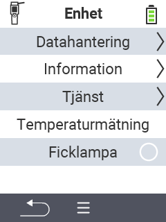

{}
Om du klickar på ett menyobjekt kommer du att omdirigeras till en beskrivning av respektive funktion.
{}

<map name="workmap">
  <area shape="rect" coords="2,40,238,80" alt="Datahantering" title="Kör datorsäkerhetskopior, exportera dina data och återställ enheten&#10;Musklick: öppna dokumentation" href="/sv/docs/device/data-management/">
  <area shape="rect" coords="2,80,238,120" alt="Info" title="Visa viktig program- och hårdvaruinformation&#10;Musklick: öppna dokumentation" href="/sv/docs/device/info/">
  <area shape="rect" coords="2,120,238,160" alt="Service" title="Kontrollera dina enhetsdrivrutiner, uppdatera din firmware och utför ett räckviddstest&#10;Musklick: öppna dokumentation" href="/sv/docs/device/service/">
  <area shape="rect" coords="2,160,238,200" alt="Temperaturmätning" title="Testa din enhets temperaturmätning&#10;Musklick: öppna dokumentation" href="/sv/docs/device/temperature-measurement/">
  <area shape="rect" coords="2,200,238,240" alt="Ficklampa" title="Slå på eller av ljuset på din VitalControl-enhet&#10;Musklick: öppna dokumentation" href="/sv/docs/device/flashlight/">

  <area shape="rect" coords="2,282,97,318" alt="Tillbaka" title="Hoppa tillbaka en nivå" href="/sv/docs/menu/mainmenu/">
</map>
