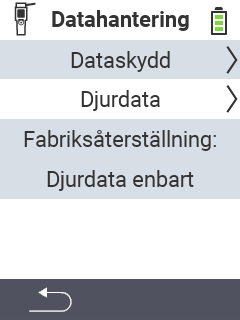

{}
Om du klickar på ett menyobjekt kommer du att omdirigeras till en beskrivning av respektive funktion.
{}

<map name="workmap">
  <area shape="rect" coords="2,40,238,80" alt="Datasäkerhetskopia" title="Instruktionerna för att skapa en säkerhetskopia finns här&#10;Musklick: öppna dokumentation" href="/en/docs/device/data-management/data-backup/">

  <area shape="rect" coords="2,80,238,120" alt="Djurdata" title="Instruktionerna för att återställa en säkerhetskopia finns här&#10;Musklick: öppna dokumentation" href="/en/docs/device/data-management/animal-data/">

  <area shape="rect" coords="2,120,238,200" alt="Återställning till fabriksinställningar" title="All information och instruktioner för att återställa enheten och djurdata finns här&#10;Musklick: öppna dokumentation" href="/en/docs/reset/">

  <area shape="rect" coords="2,282,120,319" alt="Tillbaka" title="All information och instruktioner för att exportera djurdata finns här&#10;Musklick: öppna dokumentation" href="/en/docs/device/">
</map>
