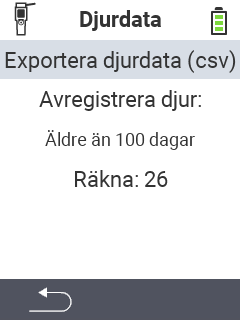

<map name="workmap">
  <area shape="rect" coords="2,40,238,80" alt="Exportera djurdata (csv)" title="Exportera din djurdata&#10;Mus klick: öppna dokumentation" href="/en/docs/data-export/usb-drive/">

  <area shape="rect" coords="2,80,238,200" alt="Avregistrera djur" title="Ange åldern från vilken djur ska avregistreras&#10;Mus klick: öppna dokumentation" href="/en/docs/device/data-management/animal-data/unregister-animal/">

  <area shape="rect" coords="2,282,120,319" alt="Tillbaka" title="All information och instruktioner för att exportera djurdata finns här&#10;Mus klick: öppna dokumentation" href="/en/docs/device/data-management/">
</map>
