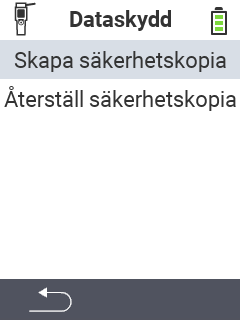

<map name="workmap">
  <area shape="rect" coords="2,40,238,80" alt="Skapa backup" title="Instruktionerna för att skapa en backup finns här&#10;Mus klick: öppna dokumentation" href="/en/docs/backup/backup/">

  <area shape="rect" coords="2,80,238,120" alt="Återställ backup" title="Instruktionerna för att återställa en backup finns här&#10;Mus klick: öppna dokumentation" href="/en/docs/backup/restore/">

  <area shape="rect" coords="2,282,120,319" alt="Tillbaka" title="Hoppa tillbaka en nivå&#10;Mus klick: öppna dokumentation" href="/en/docs/device/data-management/">
</map>
